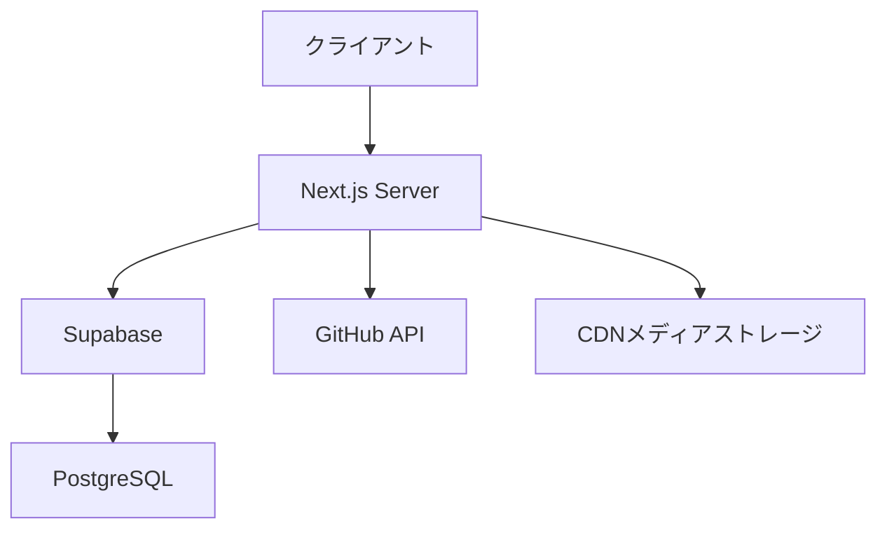
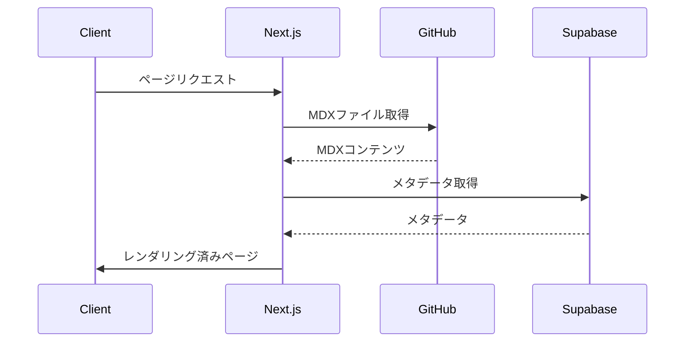
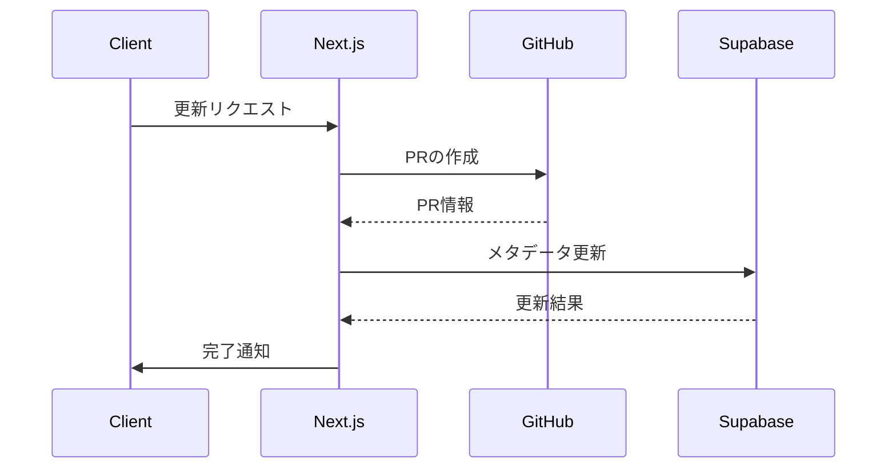

# アーキテクチャ実装詳細

## 1. 全体アーキテクチャ

### 1.1 システム構成図



### 1.2 主要コンポーネント
- Next.js Server: アプリケーションサーバー
- Supabase: 認証・データベース・ストレージ
- GitHub API: コンテンツ管理
- CDN: メディアアセットの配信

## 2. フロントエンド実装

### 2.1 ページ構成

```typescript
// app/layout.tsx
import { Providers } from '@/components/providers'

export default function RootLayout({
  children,
}: {
  children: React.ReactNode
}) {
  return (
    <html lang="ja">
      <body>
        <Providers>{children}</Providers>
      </body>
    </html>
  )
}

// app/docs/[...slug]/page.tsx
import { getDocFromParams } from '@/lib/mdx'
import { MDXComponent } from '@/components/mdx'

export default async function DocPage({ params }: {
  params: { slug: string[] }
}) {
  const doc = await getDocFromParams(params.slug)
  return <MDXComponent {...doc} />
}
```

### 2.2 状態管理

```typescript
// lib/store/content.ts
import { atom } from 'jotai'

export const contentAtom = atom({
  currentDoc: null,
  navigation: [],
  breadcrumbs: []
})

// lib/store/progress.ts
export const progressAtom = atom({
  readPages: [],
  currentProgress: 0
})
```

## 3. バックエンド実装

### 3.1 APIルート構成

```typescript
// app/api/content/route.ts
import { createRouteHandlerClient } from '@supabase/auth-helpers-nextjs'

export async function GET(request: Request) {
  const supabase = createRouteHandlerClient({ cookies })
  // コンテンツ取得ロジック
}

export async function POST(request: Request) {
  const supabase = createRouteHandlerClient({ cookies })
  // コンテンツ作成ロジック
}
```

### 3.2 ミドルウェア

```typescript
// middleware.ts
import { createMiddlewareClient } from '@supabase/auth-helpers-nextjs'

export async function middleware(req: NextRequest) {
  const res = NextResponse.next()
  const supabase = createMiddlewareClient({ req, res })
  
  // セッション確認
  const { data: { session } } = await supabase.auth.getSession()
  
  // 認証必要なルートの保護
  if (!session && req.nextUrl.pathname.startsWith('/admin')) {
    return NextResponse.redirect(new URL('/login', req.url))
  }
  
  return res
}
```

## 4. データフロー

### 4.1 コンテンツ取得フロー



### 4.2 コンテンツ更新フロー



## 5. エラーハンドリング

### 5.1 グローバルエラーハンドリング

```typescript
// app/error.tsx
'use client'

export default function Error({
  error,
  reset,
}: {
  error: Error
  reset: () => void
}) {
  return (
    <div className="error-container">
      <h2>エラーが発生しました</h2>
      <button onClick={() => reset()}>再試行</button>
    </div>
  )
}
```

### 5.2 API エラーハンドリング

```typescript
// lib/error.ts
export class APIError extends Error {
  constructor(
    message: string,
    public statusCode: number,
    public code: string
  ) {
    super(message)
  }
}

// エラーハンドリングミドルウェア
export async function errorHandler(error: unknown) {
  if (error instanceof APIError) {
    return Response.json(
      { error: error.message },
      { status: error.statusCode }
    )
  }
  
  console.error(error)
  return Response.json(
    { error: 'Internal Server Error' },
    { status: 500 }
  )
}
```

## 6. パフォーマンス最適化

### 6.1 画像最適化

```typescript
// next.config.mjs
export default {
  images: {
    domains: ['your-supabase-storage-url'],
    formats: ['image/avif', 'image/webp'],
  }
}

// components/mdx/Image.tsx
import Image from 'next/image'

export function MDXImage({ src, alt, ...props }) {
  return (
    <Image
      src={src}
      alt={alt}
      width={720}
      height={480}
      className="rounded-lg"
      loading="lazy"
      {...props}
    />
  )
}
```

### 6.2 キャッシュ戦略

```typescript
// lib/cache.ts
import { cache } from 'react'

export const getContent = cache(async (slug: string) => {
  // コンテンツ取得ロジック
})

// app/docs/[...slug]/page.tsx
export const revalidate = 3600 // 1時間ごとに再検証
```

## 7. セキュリティ実装

### 7.1 認証フロー

```typescript
// lib/auth.ts
import { createClientComponentClient } from '@supabase/auth-helpers-nextjs'

export async function signIn(email: string, password: string) {
  const supabase = createClientComponentClient()
  const { data, error } = await supabase.auth.signInWithPassword({
    email,
    password,
  })
  
  if (error) throw error
  return data
}
```

### 7.2 CORS設定

```typescript
// middleware.ts
export const config = {
  matcher: '/api/:path*',
}

export function middleware(request: NextRequest) {
  const response = NextResponse.next()
  
  // CORS ヘッダーの設定
  response.headers.set('Access-Control-Allow-Origin', '*')
  response.headers.set(
    'Access-Control-Allow-Methods',
    'GET, POST, PUT, DELETE, OPTIONS'
  )
  
  return response
}
```

## 8. 監視と分析

### 8.1 パフォーマンスモニタリング

```typescript
// lib/monitoring.ts
export function trackPerformance(metric: string, value: number) {
  if (typeof window !== 'undefined') {
    // Web Vitalsの記録
    window.performance.mark(metric)
  }
}
```

### 8.2 エラー追跡

```typescript
// lib/error-tracking.ts
export function trackError(error: Error) {
  console.error('[Error]', {
    message: error.message,
    stack: error.stack,
    timestamp: new Date().toISOString(),
  })
}
```

## 9. 次のステップ

1. データベースのセットアップ
2. 認証機能の実装
3. コンテンツ管理機能の実装
4. メディア管理機能の実装 