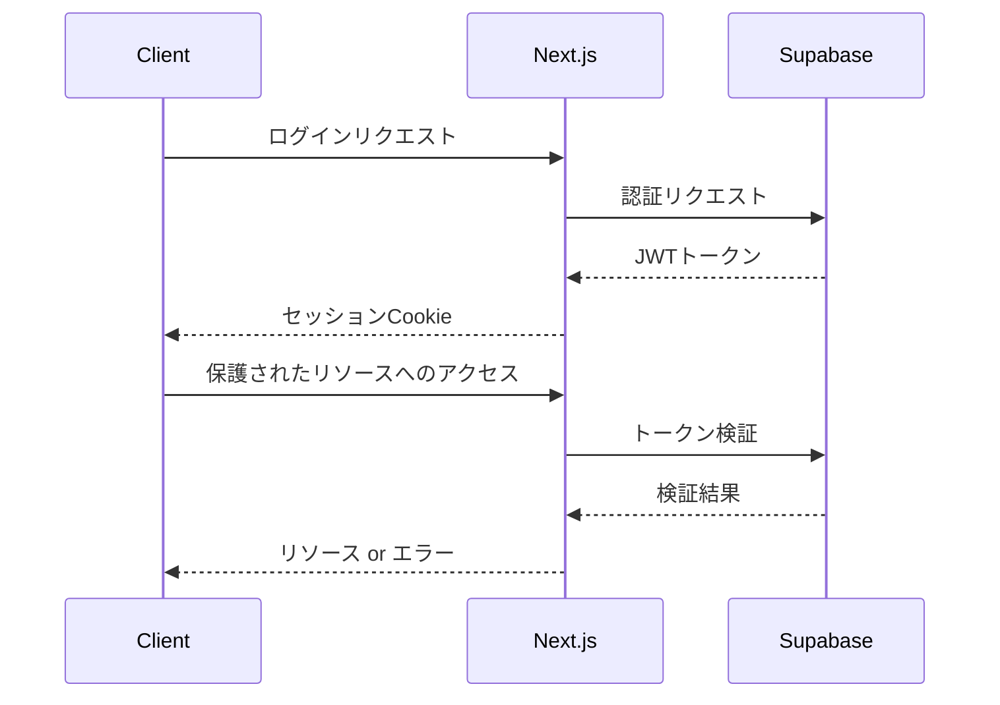

# 認証機能の実装計画

## 1. 認証システムの概要

### 1.1 認証フロー



### 1.2 認証方式
- メール/パスワード認証
- GitHubソーシャルログイン（オプション）
- Magic Link認証（オプション）

## 2. 認証コンポーネントの実装

### 2.1 ログインフォーム

```typescript
// components/auth/LoginForm.tsx
'use client'

import { useState } from 'react'
import { createClientComponentClient } from '@supabase/auth-helpers-nextjs'

export function LoginForm() {
  const [email, setEmail] = useState('')
  const [password, setPassword] = useState('')
  const [error, setError] = useState<string | null>(null)
  const supabase = createClientComponentClient()

  const handleSubmit = async (e: React.FormEvent) => {
    e.preventDefault()
    setError(null)

    try {
      const { error } = await supabase.auth.signInWithPassword({
        email,
        password,
      })

      if (error) throw error
      
      // ログイン後のリダイレクト
      window.location.href = '/dashboard'
    } catch (err) {
      setError('ログインに失敗しました')
    }
  }

  return (
    <form onSubmit={handleSubmit}>
      {/* フォームの実装 */}
    </form>
  )
}
```

### 2.2 サインアップフォーム

```typescript
// components/auth/SignUpForm.tsx
'use client'

import { useState } from 'react'
import { createClientComponentClient } from '@supabase/auth-helpers-nextjs'

export function SignUpForm() {
  const [email, setEmail] = useState('')
  const [password, setPassword] = useState('')
  const [fullName, setFullName] = useState('')
  const [error, setError] = useState<string | null>(null)
  const supabase = createClientComponentClient()

  const handleSubmit = async (e: React.FormEvent) => {
    e.preventDefault()
    setError(null)

    try {
      const { error: signUpError } = await supabase.auth.signUp({
        email,
        password,
        options: {
          data: {
            full_name: fullName,
          },
        },
      })

      if (signUpError) throw signUpError

      // ユーザープロフィールの作成
      const { error: profileError } = await supabase
        .from('users')
        .insert([
          {
            email,
            full_name: fullName,
            role: 'reader',
          },
        ])

      if (profileError) throw profileError
      
      // 確認メール送信後の画面へリダイレクト
      window.location.href = '/auth/verify'
    } catch (err) {
      setError('アカウントの作成に失敗しました')
    }
  }

  return (
    <form onSubmit={handleSubmit}>
      {/* フォームの実装 */}
    </form>
  )
}
```

## 3. 認証ミドルウェアの実装

### 3.1 ルート保護

```typescript
// middleware.ts
import { createMiddlewareClient } from '@supabase/auth-helpers-nextjs'
import { NextResponse } from 'next/server'
import type { NextRequest } from 'next/server'

export async function middleware(req: NextRequest) {
  const res = NextResponse.next()
  const supabase = createMiddlewareClient({ req, res })
  const { data: { session } } = await supabase.auth.getSession()

  // 保護されたルートの設定
  const protectedRoutes = ['/admin', '/dashboard']
  const isProtectedRoute = protectedRoutes.some(route => 
    req.nextUrl.pathname.startsWith(route)
  )

  if (!session && isProtectedRoute) {
    const redirectUrl = new URL('/auth/login', req.url)
    redirectUrl.searchParams.set('redirect', req.nextUrl.pathname)
    return NextResponse.redirect(redirectUrl)
  }

  return res
}

export const config = {
  matcher: [
    '/admin/:path*',
    '/dashboard/:path*',
    '/auth/:path*',
  ],
}
```

### 3.2 ロールベースのアクセス制御

```typescript
// lib/auth/rbac.ts
export const ROLES = {
  ADMIN: 'admin',
  AUTHOR: 'author',
  READER: 'reader',
} as const

export type Role = typeof ROLES[keyof typeof ROLES]

export const ROLE_PERMISSIONS = {
  [ROLES.ADMIN]: ['manage_users', 'manage_content', 'read_content'],
  [ROLES.AUTHOR]: ['manage_own_content', 'read_content'],
  [ROLES.READER]: ['read_content'],
} as const

export function hasPermission(
  userRole: Role,
  requiredPermission: string
): boolean {
  return ROLE_PERMISSIONS[userRole]?.includes(requiredPermission) ?? false
}

// components/auth/RoleGuard.tsx
interface RoleGuardProps {
  requiredRole: Role
  children: React.ReactNode
}

export function RoleGuard({ requiredRole, children }: RoleGuardProps) {
  const { data: { user } } = useUser()
  const userRole = user?.user_metadata?.role as Role

  if (!userRole || !hasPermission(userRole, requiredRole)) {
    return <div>アクセス権限がありません</div>
  }

  return <>{children}</>
}
```

## 4. セッション管理

### 4.1 セッションプロバイダー

```typescript
// components/providers/SessionProvider.tsx
'use client'

import { createContext, useContext, useEffect, useState } from 'react'
import { createClientComponentClient } from '@supabase/auth-helpers-nextjs'
import type { User } from '@supabase/auth-helpers-nextjs'

interface SessionContextType {
  user: User | null
  loading: boolean
}

const SessionContext = createContext<SessionContextType>({
  user: null,
  loading: true,
})

export function SessionProvider({
  children,
}: {
  children: React.ReactNode
}) {
  const [user, setUser] = useState<User | null>(null)
  const [loading, setLoading] = useState(true)
  const supabase = createClientComponentClient()

  useEffect(() => {
    const {
      data: { subscription },
    } = supabase.auth.onAuthStateChange((event, session) => {
      setUser(session?.user ?? null)
      setLoading(false)
    })

    return () => {
      subscription.unsubscribe()
    }
  }, [])

  return (
    <SessionContext.Provider value={{ user, loading }}>
      {children}
    </SessionContext.Provider>
  )
}

export const useSession = () => useContext(SessionContext)
```

### 4.2 セッションの永続化

```typescript
// app/layout.tsx
import { headers, cookies } from 'next/headers'
import { createServerComponentClient } from '@supabase/auth-helpers-nextjs'

export default async function RootLayout({
  children,
}: {
  children: React.ReactNode
}) {
  const supabase = createServerComponentClient({ cookies })
  const { data: { session } } = await supabase.auth.getSession()

  return (
    <html lang="ja">
      <body>
        <SessionProvider initialSession={session}>
          {children}
        </SessionProvider>
      </body>
    </html>
  )
}
```

## 5. エラーハンドリング

### 5.1 認証エラーの処理

```typescript
// lib/auth/errors.ts
export class AuthError extends Error {
  constructor(
    message: string,
    public code: string,
    public status: number = 401
  ) {
    super(message)
    this.name = 'AuthError'
  }
}

export function handleAuthError(error: unknown) {
  if (error instanceof AuthError) {
    return {
      message: error.message,
      code: error.code,
      status: error.status,
    }
  }

  return {
    message: '認証エラーが発生しました',
    code: 'unknown_error',
    status: 500,
  }
}
```

### 5.2 エラーバウンダリー

```typescript
// components/auth/AuthErrorBoundary.tsx
'use client'

import { Component, ErrorInfo, ReactNode } from 'react'

interface Props {
  children: ReactNode
}

interface State {
  hasError: boolean
  error?: Error
}

export class AuthErrorBoundary extends Component<Props, State> {
  public state: State = {
    hasError: false,
  }

  public static getDerivedStateFromError(error: Error): State {
    return { hasError: true, error }
  }

  public componentDidCatch(error: Error, errorInfo: ErrorInfo) {
    console.error('認証エラー:', error, errorInfo)
  }

  public render() {
    if (this.state.hasError) {
      return (
        <div className="auth-error">
          <h2>認証エラーが発生しました</h2>
          <p>{this.state.error?.message}</p>
          <button onClick={() => this.setState({ hasError: false })}>
            再試行
          </button>
        </div>
      )
    }

    return this.props.children
  }
}
```

## 6. セキュリティ対策

### 6.1 パスワードポリシー

```typescript
// lib/auth/password.ts
export const PASSWORD_RULES = {
  minLength: 8,
  requireUppercase: true,
  requireLowercase: true,
  requireNumber: true,
  requireSpecialChar: true,
}

export function validatePassword(password: string): {
  isValid: boolean
  errors: string[]
} {
  const errors: string[] = []

  if (password.length < PASSWORD_RULES.minLength) {
    errors.push(`パスワードは${PASSWORD_RULES.minLength}文字以上である必要があります`)
  }

  if (PASSWORD_RULES.requireUppercase && !/[A-Z]/.test(password)) {
    errors.push('大文字を含める必要があります')
  }

  if (PASSWORD_RULES.requireLowercase && !/[a-z]/.test(password)) {
    errors.push('小文字を含める必要があります')
  }

  if (PASSWORD_RULES.requireNumber && !/\d/.test(password)) {
    errors.push('数字を含める必要があります')
  }

  if (PASSWORD_RULES.requireSpecialChar && !/[!@#$%^&*]/.test(password)) {
    errors.push('特殊文字を含める必要があります')
  }

  return {
    isValid: errors.length === 0,
    errors,
  }
}
```

### 6.2 レート制限

```typescript
// middleware.ts
import rateLimit from 'express-rate-limit'

const authLimiter = rateLimit({
  windowMs: 15 * 60 * 1000, // 15分
  max: 5, // IPアドレスごとに5回まで
  message: '試行回数が多すぎます。しばらく時間をおいて再試行してください。',
})

export const config = {
  matcher: ['/api/auth/:path*'],
}

export async function middleware(req: NextRequest) {
  if (req.nextUrl.pathname.startsWith('/api/auth')) {
    return authLimiter(req as any, NextResponse.next() as any)
  }
  return NextResponse.next()
}
```

## 7. 次のステップ

1. コンテンツ管理機能の実装
2. メディア管理機能の実装
3. 学習進捗機能の実装
4. デプロイメントフローの設定 