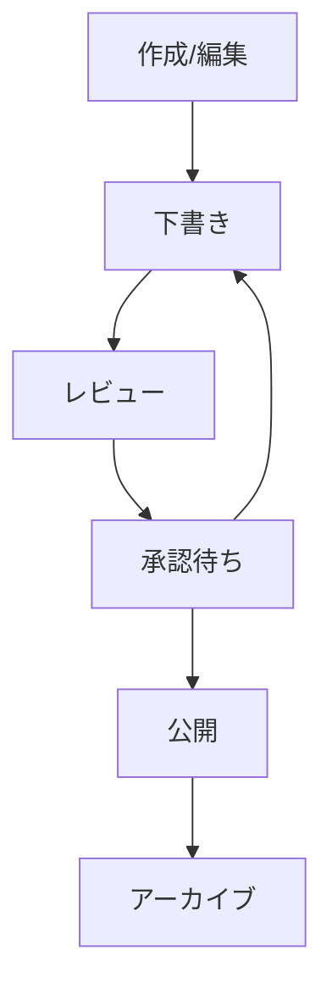

# コンテンツ管理機能の実装計画

## 1. コンテンツ管理システムの概要

### 1.1 機能概要
- MDXコンテンツの作成・編集・削除
- コンテンツのバージョン管理
- メタデータの管理
- カテゴリー/タグ管理
- 検索・フィルタリング

### 1.2 コンテンツフロー



## 2. MDXコンテンツ管理

### 2.1 MDXエディタコンポーネント

```typescript
// components/mdx/Editor.tsx
'use client'

import { useState } from 'react'
import { MDXEditor } from '@mdx-editor/editor'
import { createClientComponentClient } from '@supabase/auth-helpers-nextjs'

interface MDXEditorProps {
  initialContent: string
  onSave: (content: string) => Promise<void>
}

export function MDXEditor({ initialContent, onSave }: MDXEditorProps) {
  const [content, setContent] = useState(initialContent)
  const [saving, setSaving] = useState(false)
  const supabase = createClientComponentClient()

  const handleSave = async () => {
    setSaving(true)
    try {
      await onSave(content)
    } finally {
      setSaving(false)
    }
  }

  return (
    <div className="mdx-editor">
      <MDXEditor
        value={content}
        onChange={setContent}
        plugins={[
          // MDXエディタのプラグイン設定
        ]}
      />
      <div className="editor-toolbar">
        <button
          onClick={handleSave}
          disabled={saving}
        >
          {saving ? '保存中...' : '保存'}
        </button>
      </div>
    </div>
  )
}
```

### 2.2 コンテンツ保存ロジック

```typescript
// lib/content/storage.ts
import { createClientComponentClient } from '@supabase/auth-helpers-nextjs'
import { Octokit } from '@octokit/rest'

interface SaveContentParams {
  slug: string
  content: string
  title: string
  description?: string
  status: 'draft' | 'review' | 'published'
}

export async function saveContent({
  slug,
  content,
  title,
  description,
  status,
}: SaveContentParams) {
  const supabase = createClientComponentClient()
  const octokit = new Octokit({
    auth: process.env.GITHUB_ACCESS_TOKEN,
  })

  // GitHubにコンテンツを保存
  const branch = `content/${slug}`
  const path = `content/docs/${slug}.mdx`
  
  await octokit.repos.createOrUpdateFileContents({
    owner: 'your-org',
    repo: 'your-repo',
    path,
    message: `Update ${slug}`,
    content: Buffer.from(content).toString('base64'),
    branch,
  })

  // Supabaseにメタデータを保存
  const { data, error } = await supabase
    .from('contents')
    .upsert({
      slug,
      title,
      description,
      status,
      content_path: path,
    })
    .select()
    .single()

  if (error) throw error
  return data
}
```

## 3. バージョン管理

### 3.1 GitHubとの連携

```typescript
// lib/content/github.ts
import { Octokit } from '@octokit/rest'

export class GitHubService {
  private octokit: Octokit

  constructor() {
    this.octokit = new Octokit({
      auth: process.env.GITHUB_ACCESS_TOKEN,
    })
  }

  async createBranch(slug: string) {
    const branch = `content/${slug}`
    await this.octokit.git.createRef({
      owner: 'your-org',
      repo: 'your-repo',
      ref: `refs/heads/${branch}`,
      sha: 'main-branch-sha', // メインブランチのSHA
    })
    return branch
  }

  async createPullRequest(branch: string, title: string) {
    const { data } = await this.octokit.pulls.create({
      owner: 'your-org',
      repo: 'your-repo',
      title,
      head: branch,
      base: 'main',
      body: 'コンテンツの更新',
    })
    return data
  }

  async getFileHistory(path: string) {
    const { data } = await this.octokit.repos.getCommits({
      owner: 'your-org',
      repo: 'your-repo',
      path,
    })
    return data
  }
}
```

### 3.2 バージョン履歴の表示

```typescript
// components/content/VersionHistory.tsx
'use client'

import { useState, useEffect } from 'react'
import { GitHubService } from '@/lib/content/github'

interface Version {
  sha: string
  message: string
  date: string
  author: string
}

export function VersionHistory({ contentPath }: { contentPath: string }) {
  const [versions, setVersions] = useState<Version[]>([])
  const [loading, setLoading] = useState(true)
  const github = new GitHubService()

  useEffect(() => {
    async function loadVersions() {
      try {
        const history = await github.getFileHistory(contentPath)
        setVersions(
          history.map(commit => ({
            sha: commit.sha,
            message: commit.commit.message,
            date: commit.commit.author.date,
            author: commit.commit.author.name,
          }))
        )
      } finally {
        setLoading(false)
      }
    }

    loadVersions()
  }, [contentPath])

  return (
    <div className="version-history">
      <h3>バージョン履歴</h3>
      {loading ? (
        <div>読み込み中...</div>
      ) : (
        <ul>
          {versions.map(version => (
            <li key={version.sha}>
              <div>{version.message}</div>
              <div>
                {version.author} - {new Date(version.date).toLocaleString()}
              </div>
            </li>
          ))}
        </ul>
      )}
    </div>
  )
}
```

## 4. メタデータ管理

### 4.1 メタデータエディタ

```typescript
// components/content/MetadataEditor.tsx
'use client'

import { useState } from 'react'
import { createClientComponentClient } from '@supabase/auth-helpers-nextjs'

interface Metadata {
  title: string
  description: string
  tags: string[]
  category: string
  order: number
}

interface MetadataEditorProps {
  initialMetadata: Metadata
  onSave: (metadata: Metadata) => Promise<void>
}

export function MetadataEditor({
  initialMetadata,
  onSave,
}: MetadataEditorProps) {
  const [metadata, setMetadata] = useState(initialMetadata)
  const [saving, setSaving] = useState(false)

  const handleSave = async () => {
    setSaving(true)
    try {
      await onSave(metadata)
    } finally {
      setSaving(false)
    }
  }

  return (
    <div className="metadata-editor">
      <div className="form-group">
        <label>タイトル</label>
        <input
          type="text"
          value={metadata.title}
          onChange={e => setMetadata({ ...metadata, title: e.target.value })}
        />
      </div>
      {/* 他のメタデータフィールド */}
      <button onClick={handleSave} disabled={saving}>
        {saving ? '保存中...' : 'メタデータを保存'}
      </button>
    </div>
  )
}
```

### 4.2 メタデータの検証

```typescript
// lib/content/validation.ts
import { z } from 'zod'

export const metadataSchema = z.object({
  title: z.string().min(1, 'タイトルは必須です'),
  description: z.string().optional(),
  tags: z.array(z.string()),
  category: z.string().min(1, 'カテゴリーは必須です'),
  order: z.number().int().min(0),
})

export function validateMetadata(metadata: unknown) {
  return metadataSchema.safeParse(metadata)
}
```

## 5. 検索・フィルタリング

### 5.1 全文検索の実装

```typescript
// lib/content/search.ts
import { createClientComponentClient } from '@supabase/auth-helpers-nextjs'

interface SearchParams {
  query: string
  category?: string
  tags?: string[]
  status?: string
}

export async function searchContent({
  query,
  category,
  tags,
  status = 'published',
}: SearchParams) {
  const supabase = createClientComponentClient()

  let queryBuilder = supabase
    .from('contents')
    .select(`
      *,
      author:users(full_name, avatar_url)
    `)
    .textSearch('title', query)
    .eq('status', status)

  if (category) {
    queryBuilder = queryBuilder.eq('metadata->category', category)
  }

  if (tags && tags.length > 0) {
    queryBuilder = queryBuilder.contains('metadata->tags', tags)
  }

  const { data, error } = await queryBuilder

  if (error) throw error
  return data
}
```

### 5.2 検索UI

```typescript
// components/content/Search.tsx
'use client'

import { useState } from 'react'
import { useDebounce } from '@/hooks/useDebounce'
import { searchContent } from '@/lib/content/search'

export function Search() {
  const [query, setQuery] = useState('')
  const [results, setResults] = useState([])
  const [loading, setLoading] = useState(false)
  const debouncedSearch = useDebounce(query, 300)

  useEffect(() => {
    async function performSearch() {
      if (!debouncedSearch) {
        setResults([])
        return
      }

      setLoading(true)
      try {
        const searchResults = await searchContent({
          query: debouncedSearch,
        })
        setResults(searchResults)
      } finally {
        setLoading(false)
      }
    }

    performSearch()
  }, [debouncedSearch])

  return (
    <div className="search">
      <input
        type="text"
        value={query}
        onChange={e => setQuery(e.target.value)}
        placeholder="コンテンツを検索..."
      />
      {loading ? (
        <div>検索中...</div>
      ) : (
        <ul className="search-results">
          {results.map(result => (
            <li key={result.id}>
              <a href={`/docs/${result.slug}`}>{result.title}</a>
            </li>
          ))}
        </ul>
      )}
    </div>
  )
}
```

## 6. コンテンツの最適化

### 6.1 MDXの最適化

```typescript
// lib/content/optimization.ts
import { bundleMDX } from 'mdx-bundler'
import rehypePrism from 'rehype-prism-plus'
import remarkGfm from 'remark-gfm'

export async function optimizeMDX(content: string) {
  const result = await bundleMDX({
    source: content,
    mdxOptions(options) {
      options.remarkPlugins = [...(options.remarkPlugins ?? []), remarkGfm]
      options.rehypePlugins = [...(options.rehypePlugins ?? []), rehypePrism]
      return options
    },
  })

  return result
}
```

### 6.2 キャッシュ戦略

```typescript
// lib/content/cache.ts
import { cache } from 'react'
import { Redis } from '@upstash/redis'

const redis = new Redis({
  url: process.env.UPSTASH_REDIS_URL!,
  token: process.env.UPSTASH_REDIS_TOKEN!,
})

export const getContentFromCache = cache(async (slug: string) => {
  // キャッシュからコンテンツを取得
  const cached = await redis.get(`content:${slug}`)
  if (cached) return cached

  // キャッシュがない場合は取得して保存
  const content = await getContent(slug)
  await redis.set(`content:${slug}`, content, {
    ex: 3600, // 1時間キャッシュ
  })

  return content
})
```

## 7. 次のステップ

1. メディア管理機能の実装
2. 学習進捗機能の実装
3. デプロイメントフローの設定
4. パフォーマンス最適化 