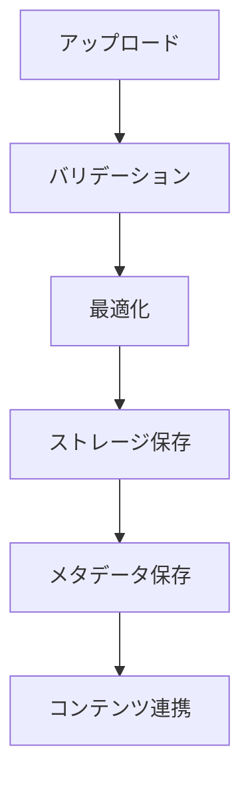

# メディア管理機能の実装計画

## 1. メディア管理システムの概要

### 1.1 機能概要
- 画像・動画のアップロード
- メディアライブラリの管理
- メディアの最適化
- メディアのバージョン管理
- メディアの使用状況追跡

### 1.2 メディアフロー



## 2. メディアアップロード

### 2.1 アップロードコンポーネント

```typescript
// components/media/Upload.tsx
'use client'

import { useState } from 'react'
import { createClientComponentClient } from '@supabase/auth-helpers-nextjs'
import { useDropzone } from 'react-dropzone'

interface UploadProps {
  contentId?: string
  onUploadComplete: (media: MediaAsset[]) => void
}

export function Upload({ contentId, onUploadComplete }: UploadProps) {
  const [uploading, setUploading] = useState(false)
  const supabase = createClientComponentClient()

  const { getRootProps, getInputProps } = useDropzone({
    accept: {
      'image/*': ['.png', '.jpg', '.jpeg', '.gif', '.webp'],
      'video/*': ['.mp4', '.webm'],
    },
    onDrop: async (files) => {
      setUploading(true)
      try {
        const uploadedMedia = await Promise.all(
          files.map(async (file) => {
            // ファイルの最適化
            const optimizedFile = await optimizeMedia(file)
            
            // Supabaseストレージにアップロード
            const { data, error } = await supabase.storage
              .from('media')
              .upload(`${contentId}/${file.name}`, optimizedFile)

            if (error) throw error

            // メディアメタデータの保存
            const { data: mediaAsset } = await supabase
              .from('media_assets')
              .insert({
                content_id: contentId,
                type: file.type.startsWith('image/') ? 'image' : 'video',
                url: data.path,
                metadata: {
                  size: file.size,
                  type: file.type,
                  dimensions: await getMediaDimensions(file),
                },
              })
              .select()
              .single()

            return mediaAsset
          })
        )

        onUploadComplete(uploadedMedia)
      } catch (error) {
        console.error('Upload error:', error)
      } finally {
        setUploading(false)
      }
    },
  })

  return (
    <div {...getRootProps()} className="upload-zone">
      <input {...getInputProps()} />
      {uploading ? (
        <div>アップロード中...</div>
      ) : (
        <div>
          ファイルをドラッグ&ドロップ、またはクリックして選択
        </div>
      )}
    </div>
  )
}
```

### 2.2 メディア最適化

```typescript
// lib/media/optimization.ts
import sharp from 'sharp'
import ffmpeg from 'fluent-ffmpeg'

interface OptimizationOptions {
  maxWidth?: number
  maxHeight?: number
  quality?: number
  format?: 'webp' | 'jpeg' | 'png'
}

export async function optimizeImage(
  file: File,
  options: OptimizationOptions = {}
) {
  const buffer = await file.arrayBuffer()
  const image = sharp(buffer)

  // 画像のリサイズ
  if (options.maxWidth || options.maxHeight) {
    image.resize(options.maxWidth, options.maxHeight, {
      fit: 'inside',
      withoutEnlargement: true,
    })
  }

  // フォーマット変換
  if (options.format) {
    image.toFormat(options.format, {
      quality: options.quality || 80,
    })
  }

  return image.toBuffer()
}

export async function optimizeVideo(file: File) {
  return new Promise((resolve, reject) => {
    const outputPath = `/tmp/${Date.now()}.mp4`

    ffmpeg(file.path)
      .videoCodec('libx264')
      .videoBitrate('1000k')
      .audioCodec('aac')
      .audioBitrate('128k')
      .size('1280x?')
      .format('mp4')
      .on('end', () => resolve(outputPath))
      .on('error', reject)
      .save(outputPath)
  })
}
```

## 3. メディアライブラリ

### 3.1 ライブラリコンポーネント

```typescript
// components/media/Library.tsx
'use client'

import { useState, useEffect } from 'react'
import { createClientComponentClient } from '@supabase/auth-helpers-nextjs'
import { MediaGrid } from './MediaGrid'
import { MediaFilters } from './MediaFilters'

interface LibraryProps {
  contentId?: string
  onSelect?: (media: MediaAsset) => void
}

export function Library({ contentId, onSelect }: LibraryProps) {
  const [media, setMedia] = useState<MediaAsset[]>([])
  const [loading, setLoading] = useState(true)
  const [filters, setFilters] = useState({
    type: 'all',
    search: '',
  })
  const supabase = createClientComponentClient()

  useEffect(() => {
    async function loadMedia() {
      setLoading(true)
      try {
        let query = supabase
          .from('media_assets')
          .select('*')
          .order('created_at', { ascending: false })

        if (contentId) {
          query = query.eq('content_id', contentId)
        }

        if (filters.type !== 'all') {
          query = query.eq('type', filters.type)
        }

        if (filters.search) {
          query = query.ilike('metadata->name', `%${filters.search}%`)
        }

        const { data } = await query

        setMedia(data || [])
      } finally {
        setLoading(false)
      }
    }

    loadMedia()
  }, [contentId, filters])

  return (
    <div className="media-library">
      <MediaFilters
        filters={filters}
        onChange={setFilters}
      />
      <MediaGrid
        media={media}
        loading={loading}
        onSelect={onSelect}
      />
    </div>
  )
}
```

### 3.2 メディアプレビュー

```typescript
// components/media/Preview.tsx
'use client'

interface PreviewProps {
  media: MediaAsset
  size?: 'small' | 'medium' | 'large'
}

export function Preview({ media, size = 'medium' }: PreviewProps) {
  const dimensions = {
    small: { width: 100, height: 100 },
    medium: { width: 200, height: 200 },
    large: { width: 400, height: 400 },
  }[size]

  if (media.type === 'image') {
    return (
      
    )
  }

  if (media.type === 'video') {
    return (
      <video
        src={media.url}
        controls
        width={dimensions.width}
        height={dimensions.height}
        className="media-preview"
      />
    )
  }

  return null
}
```

## 4. メディアの使用状況追跡

### 4.1 使用状況の管理

```typescript
// lib/media/usage.ts
import { createClientComponentClient } from '@supabase/auth-helpers-nextjs'

interface MediaUsage {
  mediaId: string
  contentId: string
  location: string
  insertedAt: Date
}

export async function trackMediaUsage(usage: Omit<MediaUsage, 'insertedAt'>) {
  const supabase = createClientComponentClient()

  const { data, error } = await supabase
    .from('media_usage')
    .insert({
      media_id: usage.mediaId,
      content_id: usage.contentId,
      location: usage.location,
    })
    .select()
    .single()

  if (error) throw error
  return data
}

export async function getMediaUsage(mediaId: string) {
  const supabase = createClientComponentClient()

  const { data, error } = await supabase
    .from('media_usage')
    .select(`
      *,
      content:contents(title, slug)
    `)
    .eq('media_id', mediaId)

  if (error) throw error
  return data
}
```

### 4.2 使用状況の表示

```typescript
// components/media/UsageInfo.tsx
'use client'

import { useState, useEffect } from 'react'
import { getMediaUsage } from '@/lib/media/usage'

interface UsageInfoProps {
  mediaId: string
}

export function UsageInfo({ mediaId }: UsageInfoProps) {
  const [usage, setUsage] = useState<MediaUsage[]>([])
  const [loading, setLoading] = useState(true)

  useEffect(() => {
    async function loadUsage() {
      try {
        const data = await getMediaUsage(mediaId)
        setUsage(data)
      } finally {
        setLoading(false)
      }
    }

    loadUsage()
  }, [mediaId])

  return (
    <div className="usage-info">
      <h3>使用箇所</h3>
      {loading ? (
        <div>読み込み中...</div>
      ) : (
        <ul>
          {usage.map(item => (
            <li key={item.id}>
              <a href={`/docs/${item.content.slug}`}>
                {item.content.title}
              </a>
              <span>{new Date(item.inserted_at).toLocaleString()}</span>
            </li>
          ))}
        </ul>
      )}
    </div>
  )
}
```

## 5. メディアの最適化とキャッシュ

### 5.1 画像の最適化

```typescript
// lib/media/image.ts
import sharp from 'sharp'
import { createClient } from '@supabase/supabase-js'

interface ImageTransformOptions {
  width?: number
  height?: number
  format?: 'webp' | 'jpeg' | 'png'
  quality?: number
}

export async function transformImage(
  url: string,
  options: ImageTransformOptions
) {
  const response = await fetch(url)
  const buffer = await response.arrayBuffer()

  let transform = sharp(buffer)

  if (options.width || options.height) {
    transform = transform.resize(options.width, options.height, {
      fit: 'inside',
      withoutEnlargement: true,
    })
  }

  if (options.format) {
    transform = transform.toFormat(options.format, {
      quality: options.quality || 80,
    })
  }

  return transform.toBuffer()
}
```

### 5.2 CDNとキャッシュ

```typescript
// lib/media/cdn.ts
import { Redis } from '@upstash/redis'

const redis = new Redis({
  url: process.env.UPSTASH_REDIS_URL!,
  token: process.env.UPSTASH_REDIS_TOKEN!,
})

interface CacheOptions {
  ttl?: number // キャッシュの有効期限（秒）
}

export async function getCachedMediaUrl(
  mediaId: string,
  options: CacheOptions = {}
) {
  const cacheKey = `media:${mediaId}`
  
  // キャッシュからURLを取得
  const cachedUrl = await redis.get(cacheKey)
  if (cachedUrl) return cachedUrl

  // URLを生成
  const url = await generateMediaUrl(mediaId)
  
  // キャッシュに保存
  await redis.set(cacheKey, url, {
    ex: options.ttl || 3600, // デフォルト1時間
  })

  return url
}
```

## 6. セキュリティと権限管理

### 6.1 アクセス制御

```typescript
// lib/media/security.ts
import { createClientComponentClient } from '@supabase/auth-helpers-nextjs'

interface MediaPermissions {
  canView: boolean
  canEdit: boolean
  canDelete: boolean
}

export async function checkMediaPermissions(
  mediaId: string
): Promise<MediaPermissions> {
  const supabase = createClientComponentClient()

  const { data: media } = await supabase
    .from('media_assets')
    .select(`
      *,
      content:contents(author_id)
    `)
    .eq('id', mediaId)
    .single()

  const { data: { user } } = await supabase.auth.getUser()

  const isAuthor = media?.content?.author_id === user?.id
  const isAdmin = user?.user_metadata?.role === 'admin'

  return {
    canView: true, // 公開メディアは誰でも閲覧可能
    canEdit: isAuthor || isAdmin,
    canDelete: isAuthor || isAdmin,
  }
}
```

### 6.2 署名付きURL

```typescript
// lib/media/signed-urls.ts
import { createClientComponentClient } from '@supabase/auth-helpers-nextjs'

interface SignedUrlOptions {
  expiresIn?: number // 有効期限（秒）
}

export async function getSignedUrl(
  path: string,
  options: SignedUrlOptions = {}
) {
  const supabase = createClientComponentClient()

  const { data, error } = await supabase
    .storage
    .from('media')
    .createSignedUrl(path, options.expiresIn || 3600)

  if (error) throw error
  return data.signedUrl
}
```

## 7. 次のステップ

1. 学習進捗機能の実装
2. デプロイメントフローの設定
3. パフォーマンス最適化
4. 監視とアラートの設定 