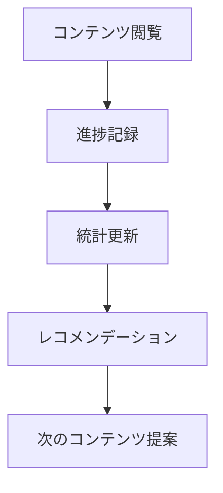

# 学習進捗機能の実装計画

## 1. 学習進捗システムの概要

### 1.1 機能概要
- 閲覧履歴の記録
- 学習進捗の追跡
- 進捗ダッシュボード
- 学習パスの管理
- レコメンデーション

### 1.2 進捗フロー



## 2. 進捗記録

### 2.1 進捗トラッキング

```typescript
// lib/progress/tracking.ts
import { createClientComponentClient } from '@supabase/auth-helpers-nextjs'

interface ProgressUpdate {
  userId: string
  contentId: string
  progress: number // 0-100
  completionStatus: 'not_started' | 'in_progress' | 'completed'
}

export async function updateProgress({
  userId,
  contentId,
  progress,
  completionStatus,
}: ProgressUpdate) {
  const supabase = createClientComponentClient()

  const { data, error } = await supabase
    .from('user_progress')
    .upsert({
      user_id: userId,
      content_id: contentId,
      progress,
      completion_status: completionStatus,
      last_read: new Date().toISOString(),
      read_count: supabase.raw('COALESCE(read_count, 0) + 1'),
    })
    .select()
    .single()

  if (error) throw error
  return data
}

export async function getProgress(userId: string, contentId: string) {
  const supabase = createClientComponentClient()

  const { data, error } = await supabase
    .from('user_progress')
    .select('*')
    .eq('user_id', userId)
    .eq('content_id', contentId)
    .single()

  if (error && error.code !== 'PGRST116') throw error // PGRST116: not found
  return data
}
```

### 2.2 進捗表示コンポーネント

```typescript
// components/progress/ProgressIndicator.tsx
'use client'

import { useState, useEffect } from 'react'
import { getProgress } from '@/lib/progress/tracking'

interface ProgressIndicatorProps {
  userId: string
  contentId: string
}

export function ProgressIndicator({
  userId,
  contentId,
}: ProgressIndicatorProps) {
  const [progress, setProgress] = useState<number>(0)
  const [status, setStatus] = useState<string>('not_started')

  useEffect(() => {
    async function loadProgress() {
      const data = await getProgress(userId, contentId)
      if (data) {
        setProgress(data.progress)
        setStatus(data.completion_status)
      }
    }

    loadProgress()
  }, [userId, contentId])

  return (
    <div className="progress-indicator">
      <div
        className="progress-bar"
        style={{ width: `${progress}%` }}
      />
      <div className="status-label">
        {status === 'completed' ? '完了' :
         status === 'in_progress' ? '学習中' : '未開始'}
      </div>
    </div>
  )
}
```

## 3. 学習パス管理

### 3.1 学習パスの定義

```typescript
// lib/progress/learning-path.ts
import { createClientComponentClient } from '@supabase/auth-helpers-nextjs'

interface LearningPath {
  id: string
  title: string
  description: string
  contents: {
    id: string
    order: number
    required: boolean
  }[]
}

export async function createLearningPath(path: Omit<LearningPath, 'id'>) {
  const supabase = createClientComponentClient()

  // 学習パスの作成
  const { data: learningPath, error: pathError } = await supabase
    .from('learning_paths')
    .insert({
      title: path.title,
      description: path.description,
    })
    .select()
    .single()

  if (pathError) throw pathError

  // コンテンツの関連付け
  const { error: contentsError } = await supabase
    .from('learning_path_contents')
    .insert(
      path.contents.map(content => ({
        learning_path_id: learningPath.id,
        content_id: content.id,
        order: content.order,
        required: content.required,
      }))
    )

  if (contentsError) throw contentsError

  return learningPath
}

export async function getLearningPathProgress(
  pathId: string,
  userId: string
) {
  const supabase = createClientComponentClient()

  const { data, error } = await supabase
    .from('learning_path_contents')
    .select(`
      content_id,
      order,
      required,
      content:contents(title),
      progress:user_progress(
        progress,
        completion_status
      )
    `)
    .eq('learning_path_id', pathId)
    .order('order')

  if (error) throw error

  return data.map(item => ({
    contentId: item.content_id,
    title: item.content.title,
    order: item.order,
    required: item.required,
    progress: item.progress?.[0]?.progress || 0,
    status: item.progress?.[0]?.completion_status || 'not_started',
  }))
}
```

### 3.2 学習パス表示

```typescript
// components/progress/LearningPathView.tsx
'use client'

import { useState, useEffect } from 'react'
import { getLearningPathProgress } from '@/lib/progress/learning-path'

interface LearningPathViewProps {
  pathId: string
  userId: string
}

export function LearningPathView({
  pathId,
  userId,
}: LearningPathViewProps) {
  const [contents, setContents] = useState([])
  const [loading, setLoading] = useState(true)

  useEffect(() => {
    async function loadPath() {
      try {
        const data = await getLearningPathProgress(pathId, userId)
        setContents(data)
      } finally {
        setLoading(false)
      }
    }

    loadPath()
  }, [pathId, userId])

  const totalProgress = contents.reduce(
    (acc, content) => acc + content.progress,
    0
  ) / contents.length

  return (
    <div className="learning-path">
      <div className="overall-progress">
        <h3>全体の進捗</h3>
        <div className="progress-bar">
          <div
            className="progress"
            style={{ width: `${totalProgress}%` }}
          />
        </div>
        <span>{Math.round(totalProgress)}%</span>
      </div>

      <div className="content-list">
        {contents.map(content => (
          <div
            key={content.contentId}
            className="content-item"
          >
            <div className="content-title">
              {content.title}
              {content.required && (
                <span className="required-badge">必須</span>
              )}
            </div>
            <ProgressIndicator
              userId={userId}
              contentId={content.contentId}
            />
          </div>
        ))}
      </div>
    </div>
  )
}
```

## 4. 進捗ダッシュボード

### 4.1 ダッシュボードデータの取得

```typescript
// lib/progress/dashboard.ts
import { createClientComponentClient } from '@supabase/auth-helpers-nextjs'

interface DashboardStats {
  totalContents: number
  completedContents: number
  inProgressContents: number
  totalReadTime: number
  lastReadContent: {
    id: string
    title: string
    progress: number
  }
  recentActivity: {
    date: string
    contentsRead: number
  }[]
}

export async function getDashboardStats(
  userId: string
): Promise<DashboardStats> {
  const supabase = createClientComponentClient()

  // 全体の統計
  const { data: stats } = await supabase
    .from('user_progress')
    .select(`
      *,
      content:contents(title)
    `)
    .eq('user_id', userId)

  // 最近の活動
  const { data: activity } = await supabase
    .from('user_progress')
    .select('last_read')
    .eq('user_id', userId)
    .gte('last_read', new Date(Date.now() - 30 * 24 * 60 * 60 * 1000))
    .order('last_read', { ascending: false })

  return {
    totalContents: stats.length,
    completedContents: stats.filter(s => s.completion_status === 'completed').length,
    inProgressContents: stats.filter(s => s.completion_status === 'in_progress').length,
    totalReadTime: stats.reduce((acc, s) => acc + (s.read_time || 0), 0),
    lastReadContent: stats[0] ? {
      id: stats[0].content_id,
      title: stats[0].content.title,
      progress: stats[0].progress,
    } : null,
    recentActivity: activity.reduce((acc, { last_read }) => {
      const date = new Date(last_read).toISOString().split('T')[0]
      const existing = acc.find(a => a.date === date)
      if (existing) {
        existing.contentsRead++
      } else {
        acc.push({ date, contentsRead: 1 })
      }
      return acc
    }, []),
  }
}
```

### 4.2 ダッシュボード表示

```typescript
// components/progress/Dashboard.tsx
'use client'

import { useState, useEffect } from 'react'
import { getDashboardStats } from '@/lib/progress/dashboard'
import { LineChart } from '@/components/charts/LineChart'

interface DashboardProps {
  userId: string
}

export function Dashboard({ userId }: DashboardProps) {
  const [stats, setStats] = useState<DashboardStats | null>(null)
  const [loading, setLoading] = useState(true)

  useEffect(() => {
    async function loadStats() {
      try {
        const data = await getDashboardStats(userId)
        setStats(data)
      } finally {
        setLoading(false)
      }
    }

    loadStats()
  }, [userId])

  if (loading) return <div>読み込み中...</div>
  if (!stats) return <div>データがありません</div>

  return (
    <div className="dashboard">
      <div className="stats-grid">
        <div className="stat-card">
          <h3>総コンテンツ数</h3>
          <div className="stat-value">{stats.totalContents}</div>
        </div>
        <div className="stat-card">
          <h3>完了</h3>
          <div className="stat-value">{stats.completedContents}</div>
        </div>
        <div className="stat-card">
          <h3>学習中</h3>
          <div className="stat-value">{stats.inProgressContents}</div>
        </div>
        <div className="stat-card">
          <h3>総学習時間</h3>
          <div className="stat-value">
            {Math.round(stats.totalReadTime / 60)}分
          </div>
        </div>
      </div>

      <div className="recent-activity">
        <h3>最近の活動</h3>
        <LineChart
          data={stats.recentActivity}
          xKey="date"
          yKey="contentsRead"
          label="閲覧したコンテンツ数"
        />
      </div>

      {stats.lastReadContent && (
        <div className="last-read">
          <h3>最後に読んだコンテンツ</h3>
          <div className="content-card">
            <h4>{stats.lastReadContent.title}</h4>
            <ProgressIndicator
              userId={userId}
              contentId={stats.lastReadContent.id}
            />
          </div>
        </div>
      )}
    </div>
  )
}
```

## 5. レコメンデーション

### 5.1 レコメンデーションロジック

```typescript
// lib/progress/recommendation.ts
import { createClientComponentClient } from '@supabase/auth-helpers-nextjs'

interface RecommendationParams {
  userId: string
  limit?: number
}

export async function getRecommendations({
  userId,
  limit = 5,
}: RecommendationParams) {
  const supabase = createClientComponentClient()

  // ユーザーの学習履歴を取得
  const { data: history } = await supabase
    .from('user_progress')
    .select('content_id, completion_status')
    .eq('user_id', userId)

  // 完了したコンテンツのカテゴリーを分析
  const { data: completedCategories } = await supabase
    .from('contents')
    .select('metadata->category')
    .in(
      'id',
      history
        .filter(h => h.completion_status === 'completed')
        .map(h => h.content_id)
    )

  // 類似のカテゴリーで未読のコンテンツを推奨
  const { data: recommendations } = await supabase
    .from('contents')
    .select(`
      *,
      author:users(full_name)
    `)
    .not('id', 'in', `(${history.map(h => h.content_id).join(',')})`)
    .in(
      'metadata->category',
      completedCategories.map(c => c.metadata.category)
    )
    .limit(limit)

  return recommendations
}
```

### 5.2 レコメンデーション表示

```typescript
// components/progress/Recommendations.tsx
'use client'

import { useState, useEffect } from 'react'
import { getRecommendations } from '@/lib/progress/recommendation'

interface RecommendationsProps {
  userId: string
}

export function Recommendations({ userId }: RecommendationsProps) {
  const [recommendations, setRecommendations] = useState([])
  const [loading, setLoading] = useState(true)

  useEffect(() => {
    async function loadRecommendations() {
      try {
        const data = await getRecommendations({ userId })
        setRecommendations(data)
      } finally {
        setLoading(false)
      }
    }

    loadRecommendations()
  }, [userId])

  return (
    <div className="recommendations">
      <h3>おすすめのコンテンツ</h3>
      {loading ? (
        <div>読み込み中...</div>
      ) : (
        <div className="recommendation-grid">
          {recommendations.map(content => (
            <div
              key={content.id}
              className="content-card"
            >
              <h4>{content.title}</h4>
              <p>{content.description}</p>
              <div className="meta">
                <span>作成者: {content.author.full_name}</span>
                <span>カテゴリー: {content.metadata.category}</span>
              </div>
              <a
                href={`/docs/${content.slug}`}
                className="read-button"
              >
                読む
              </a>
            </div>
          ))}
        </div>
      )}
    </div>
  )
}
```

## 6. 次のステップ

1. デプロイメントフローの設定
2. パフォーマンス最適化
3. 監視とアラートの設定
4. ユーザーフィードバックの収集 