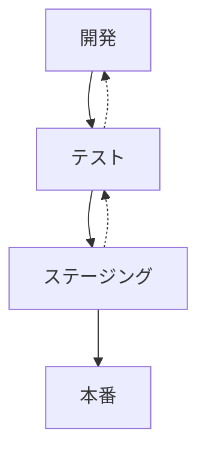

# デプロイメントフロー設定

## 1. デプロイメント概要

### 1.1 デプロイメントフロー



### 1.2 環境構成
- 開発環境（Development）
- テスト環境（Testing）
- ステージング環境（Staging）
- 本番環境（Production）

## 2. CI/CD パイプライン

### 2.1 GitHub Actions設定

```yaml
# .github/workflows/ci.yml
name: CI/CD Pipeline

on:
  push:
    branches: [main, develop]
  pull_request:
    branches: [main, develop]

jobs:
  test:
    runs-on: ubuntu-latest
    steps:
      - uses: actions/checkout@v4
      - uses: oven-sh/setup-bun@v1
      
      - name: Install dependencies
        run: bun install
        
      - name: Run tests
        run: bun test
        
      - name: Run lint
        run: bun run lint
        
  build:
    needs: test
    runs-on: ubuntu-latest
    steps:
      - uses: actions/checkout@v4
      - uses: oven-sh/setup-bun@v1
      
      - name: Install dependencies
        run: bun install
        
      - name: Build
        run: bun run build
        
      - name: Upload build artifacts
        uses: actions/upload-artifact@v3
        with:
          name: build
          path: .next
          
  deploy-staging:
    needs: build
    if: github.ref == 'refs/heads/develop'
    runs-on: ubuntu-latest
    steps:
      - uses: actions/checkout@v4
      - uses: actions/download-artifact@v3
        with:
          name: build
          
      - name: Deploy to Vercel (Staging)
        uses: amondnet/vercel-action@v25
        with:
          vercel-token: ${{ secrets.VERCEL_TOKEN }}
          vercel-org-id: ${{ secrets.VERCEL_ORG_ID }}
          vercel-project-id: ${{ secrets.VERCEL_PROJECT_ID }}
          vercel-args: '--prebuilt --prod'
          
  deploy-production:
    needs: build
    if: github.ref == 'refs/heads/main'
    runs-on: ubuntu-latest
    steps:
      - uses: actions/checkout@v4
      - uses: actions/download-artifact@v3
        with:
          name: build
          
      - name: Deploy to Vercel (Production)
        uses: amondnet/vercel-action@v25
        with:
          vercel-token: ${{ secrets.VERCEL_TOKEN }}
          vercel-org-id: ${{ secrets.VERCEL_ORG_ID }}
          vercel-project-id: ${{ secrets.VERCEL_PROJECT_ID }}
          vercel-args: '--prebuilt --prod'
```

### 2.2 環境変数の管理

```typescript
// lib/config/env.ts
import { z } from 'zod'

const envSchema = z.object({
  // Next.js
  NEXT_PUBLIC_APP_URL: z.string().url(),
  
  // Supabase
  NEXT_PUBLIC_SUPABASE_URL: z.string().url(),
  NEXT_PUBLIC_SUPABASE_ANON_KEY: z.string(),
  SUPABASE_SERVICE_ROLE_KEY: z.string(),
  
  // GitHub
  GITHUB_ACCESS_TOKEN: z.string(),
  
  // Redis
  UPSTASH_REDIS_URL: z.string().url(),
  UPSTASH_REDIS_TOKEN: z.string(),
})

declare global {
  namespace NodeJS {
    interface ProcessEnv extends z.infer<typeof envSchema> {}
  }
}

export function validateEnv() {
  try {
    envSchema.parse(process.env)
  } catch (error) {
    console.error('Invalid environment variables:', error)
    process.exit(1)
  }
}
```

## 3. インフラストラクチャ設定

### 3.1 Vercel設定

```json
// vercel.json
{
  "version": 2,
  "builds": [
    {
      "src": "package.json",
      "use": "@vercel/next"
    }
  ],
  "routes": [
    {
      "src": "/(.*)",
      "dest": "/$1"
    }
  ],
  "env": {
    "NEXT_PUBLIC_APP_URL": "@next_public_app_url",
    "NEXT_PUBLIC_SUPABASE_URL": "@next_public_supabase_url",
    "NEXT_PUBLIC_SUPABASE_ANON_KEY": "@next_public_supabase_anon_key"
  }
}
```

### 3.2 Supabase設定

```sql
-- supabase/config.toml
[api]
enabled = true
port = 54321
schemas = ["public", "storage"]
extra_search_path = ["public", "extensions"]
max_rows = 1000

[db]
port = 54322
shadow_port = 54320
major_version = 15

[studio]
enabled = true
port = 54323
api_url = "http://localhost:54321"

[storage]
enabled = true
file_size_limit = "50MB"
```

## 4. デプロイメント手順

### 4.1 本番デプロイ手順

```bash
#!/bin/bash
# scripts/deploy-production.sh

# 環境変数の検証
bun run validate-env

# データベースマイグレーション
bun run migrate

# ビルド
bun run build

# デプロイ
vercel deploy --prod
```

### 4.2 ロールバック手順

```bash
#!/bin/bash
# scripts/rollback.sh

# 前回のデプロイメントにロールバック
vercel rollback

# データベースのロールバック
bun run migrate:down
```

## 5. 監視とアラート

### 5.1 パフォーマンスモニタリング

```typescript
// lib/monitoring/performance.ts
export function trackPerformance() {
  if (typeof window === 'undefined') return

  // Core Web Vitals
  const vitals = {
    FCP: 0,
    LCP: 0,
    CLS: 0,
    FID: 0,
  }

  new PerformanceObserver((entryList) => {
    for (const entry of entryList.getEntries()) {
      vitals[entry.name] = entry.value
    }
  }).observe({ entryTypes: ['web-vital'] })

  // カスタムメトリクス
  performance.mark('app-ready')
}
```

### 5.2 エラー監視

```typescript
// lib/monitoring/error.ts
interface ErrorEvent {
  message: string
  stack?: string
  context?: Record<string, unknown>
  timestamp: string
}

export async function trackError(error: Error, context?: Record<string, unknown>) {
  const errorEvent: ErrorEvent = {
    message: error.message,
    stack: error.stack,
    context,
    timestamp: new Date().toISOString(),
  }

  // エラーの記録
  console.error('Error:', errorEvent)

  // アラートの送信（重大なエラーの場合）
  if (isCriticalError(error)) {
    await sendAlert(errorEvent)
  }
}

async function sendAlert(event: ErrorEvent) {
  // Slackなどへの通知
  const webhook = process.env.SLACK_WEBHOOK_URL
  if (webhook) {
    await fetch(webhook, {
      method: 'POST',
      headers: {
        'Content-Type': 'application/json',
      },
      body: JSON.stringify({
        text: `🚨 Critical Error:\n${event.message}\n\`\`\`${event.stack}\`\`\``,
      }),
    })
  }
}
```

## 6. バックアップと復元

### 6.1 自動バックアップ設定

```typescript
// lib/backup/scheduler.ts
import { CronJob } from 'cron'
import { createClient } from '@supabase/supabase-js'

export function setupBackupScheduler() {
  // 毎日深夜3時にバックアップを実行
  new CronJob('0 3 * * *', async () => {
    const timestamp = new Date().toISOString()
    const supabase = createClient(
      process.env.SUPABASE_URL!,
      process.env.SUPABASE_SERVICE_ROLE_KEY!
    )

    // データベースバックアップ
    await backupDatabase(supabase, timestamp)

    // メディアファイルのバックアップ
    await backupMedia(supabase, timestamp)

    console.log(`Backup completed: ${timestamp}`)
  }).start()
}

async function backupDatabase(supabase: any, timestamp: string) {
  // データベースのダンプを作成
  const { data, error } = await supabase.rpc('backup_database', {
    backup_name: `backup_${timestamp}.sql`,
  })

  if (error) throw error

  // バックアップファイルをクラウドストレージに保存
  await supabase.storage
    .from('backups')
    .upload(`database/${timestamp}.sql`, data)
}

async function backupMedia(supabase: any, timestamp: string) {
  // メディアファイルのリストを取得
  const { data: files } = await supabase.storage
    .from('media')
    .list()

  // 各ファイルをバックアップ
  for (const file of files) {
    const { data } = await supabase.storage
      .from('media')
      .download(file.name)

    await supabase.storage
      .from('backups')
      .upload(`media/${timestamp}/${file.name}`, data)
  }
}
```

### 6.2 復元手順

```typescript
// lib/backup/restore.ts
export async function restoreFromBackup(timestamp: string) {
  const supabase = createClient(
    process.env.SUPABASE_URL!,
    process.env.SUPABASE_SERVICE_ROLE_KEY!
  )

  // データベースの復元
  await restoreDatabase(supabase, timestamp)

  // メディアファイルの復元
  await restoreMedia(supabase, timestamp)
}

async function restoreDatabase(supabase: any, timestamp: string) {
  // バックアップファイルの取得
  const { data } = await supabase.storage
    .from('backups')
    .download(`database/${timestamp}.sql`)

  // データベースの復元
  await supabase.rpc('restore_database', {
    backup_file: data,
  })
}

async function restoreMedia(supabase: any, timestamp: string) {
  // バックアップからメディアファイルを復元
  const { data: files } = await supabase.storage
    .from('backups')
    .list(`media/${timestamp}`)

  for (const file of files) {
    const { data } = await supabase.storage
      .from('backups')
      .download(`media/${timestamp}/${file.name}`)

    await supabase.storage
      .from('media')
      .upload(file.name, data, {
        upsert: true,
      })
  }
}
```

## 7. 次のステップ

1. 負荷テストの実施
2. セキュリティ監査の実施
3. パフォーマンス最適化
4. ドキュメントの更新 