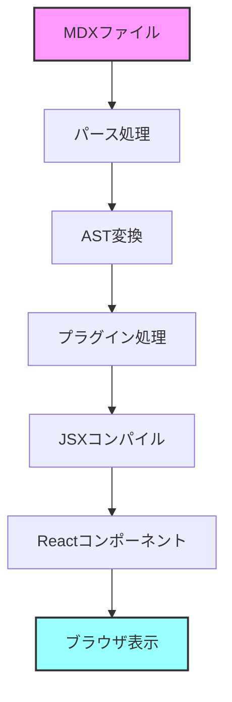
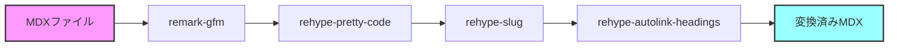
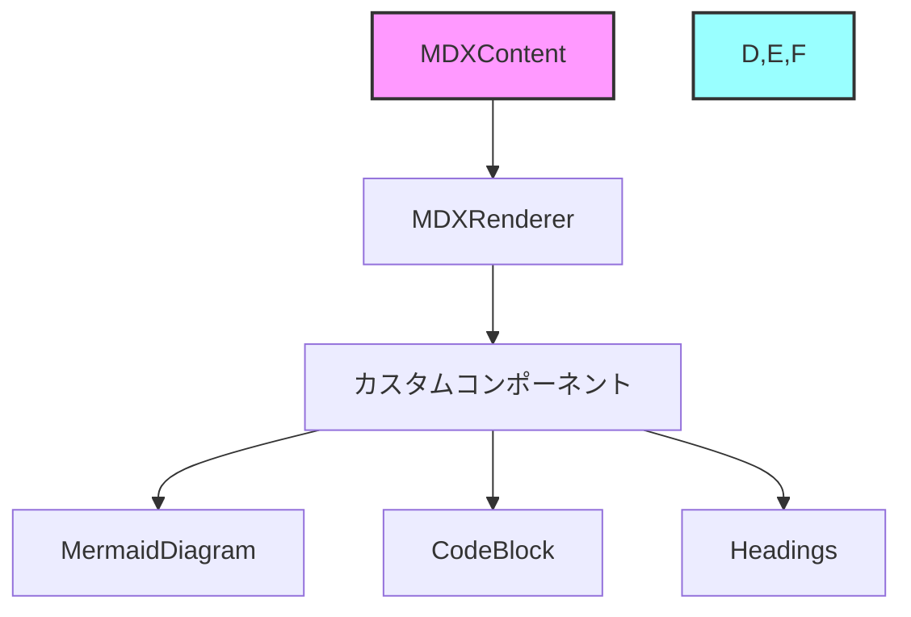
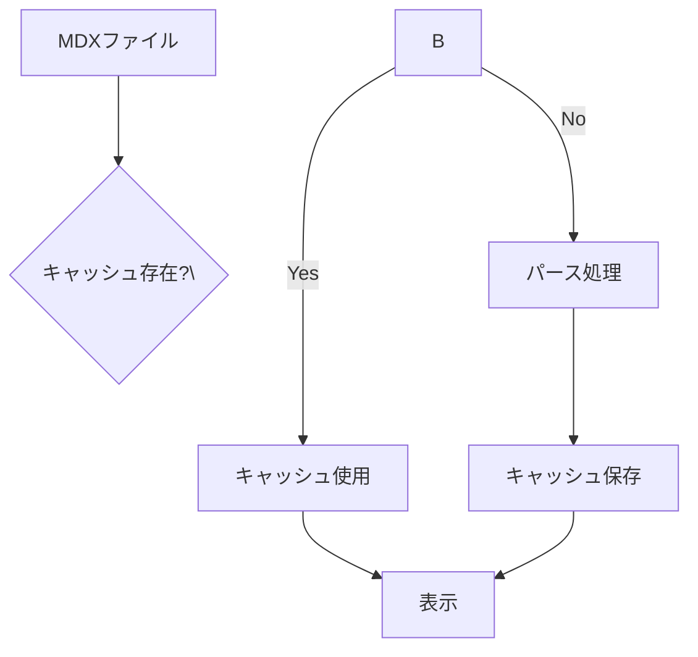

# 実装

## はじめに

このガイドでは、実装に関する情報を提供します。
初めて実装に触れる方でも理解できるように、必要な前提知識から実装の詳細まで段階的に説明していきます。

## 前提知識

### 必要なスキル

以下のスキルや知識があると、実装の理解がスムーズです：

1. **基本的なスキル**
   - Markdown記法の基本
   - HTML/CSSの基礎
   - JavaScriptの基礎

2. **推奨される知識**
   - React.jsの基本概念（コンポーネント、フック、JSX）
   - Next.jsの基本的な使い方
   - TypeScriptの基本文法

3. **あると便利な知識**
   - AST（抽象構文木）の概念
   - バンドラーの仕組み
   - Node.jsのモジュールシステム

## MDXとは

### 概要

MDX（Markdown + JSX）は、Markdownの中でJSX（React Components）を使用できる拡張フォーマットです。
通常のMarkdownの機能に加えて、インタラクティブなコンポーネントを文書内に埋め込むことができます。

### 基本的な使い方

```mdx
---
title: "サンプルページ"
---

# こんにちは

これは通常のMarkdownです。

<CustomComponent>
  これはReactコンポーネントです
</CustomComponent>

- リスト項目1
- リスト項目2
```

## 処理の流れ

MDXファイルが表示されるまでの処理フローを図解で説明します：



## 使用しているライブラリ

### コア機能

1. **mdx-bundler (v10.1.1)**
   - 主な役割：MDXファイルのバンドルとコンパイル
   - 使用例：
   ```typescript
   import { bundleMDX } from 'mdx-bundler'
   
   const \{ code, frontmatter \} = await bundleMDX(\{
     source: mdxContent,
     mdxOptions: \{
       remarkPlugins: [remarkGfm],
       rehypePlugins: [rehypePrettyCode]
     \}
   \})
   ```

2. **@mdx-js/react (v3.1.0)**
   - 主な役割：MDXコンテンツのReactでの表示
   - 使用例：
   ```text
   import { getMDXComponent } from 'mdx-bundler/client'
   
   const Component = getMDXComponent(code)
   return <Component components={customComponents} />
   ```

### 変換プラグイン



1. **remark-gfm (v4.0.1)**
   - 機能：GitHub Flavored Markdown対応
   - 提供する機能：
     - テーブル
     - タスクリスト
     - 取り消し線
     - 自動リンク
     - 脚注

2. **rehype-pretty-code (v0.14.0)**
   - 機能：シンタックスハイライト
   - 例：
   ```typescript
   // このようなコードブロックがハイライトされます
   function hello() \{
     console.log\("Hello, World!"\);
   \}
   ```

3. **rehype-slug (v6.0.0) & rehype-autolink-headings (v7.1.0)**
   - 機能：見出しへのID付与と自動リンク生成
   - 例：
     # 見出し → <h1 id="見出し"><a href="#見出し">見出し</a></h1>

### 補助ライブラリ

1. **gray-matter (v4.0.3)**
   - 機能：Frontmatterのパース
   - 使用例：
   ```typescript
   import matter from 'gray-matter'
   
   const \{ data, content \} = matter(`---
   title: Hello
   ---
   
   # Content`)
   ```

2. **mermaid (v11.4.1)**
   - 機能：ダイアグラム描画
   - 使用例：
   ```mermaid
   graph TD
       A[開始] --> B[処理1]
       B --> C[処理2]
       C --> D[終了]
   ```

## 実装構造

### コンポーネント構成



### ファイル構成

```plaintext
apps/docs/
├── components/
│   └── mdx/
│       ├── mdx-content.tsx    # メインのMDXレンダラー
│       ├── mermaid-diagram.tsx # ダイアグラム表示
│       ├── mermaid-types.ts   # 型定義
│       └── useMermaidDiagram.ts # ダイアグラムのロジック
└── lib/
    └── docs.ts               # MDX処理のユーティリティ
```

## 注意点とベストプラクティス

### セキュリティ

1. **コンテンツの検証**
   - 信頼できるソースからのMDXのみを処理
   - ユーザー入力のMDXは適切にサニタイズ

2. **実行コンテキスト**
   - MDXはJavaScriptを実行可能
   - 適切なサンドボックス環境での実行を検討

### パフォーマンス

1. **最適化のポイント**
   - 大きなMDXファイルの分割
   - 適切なキャッシュ戦略
   - 動的インポートの活用

2. **レンダリングの最適化**


### 互換性

1. **バージョン管理**
   - プラグインの互換性確認
   - React/Next.jsバージョンとの整合性

2. **アップグレード時の注意**
   - 破壊的変更の確認
   - 段階的なアップグレード

## トラブルシューティング

### よくある問題と解決方法

1. **ハイドレーションエラー**
   - 原因：サーバーとクライアントでの出力の不一致
   - 解決：
     - \`suppressHydrationWarning\`の使用
     - クライアントサイドのみの機能は\`useEffect\`内で実行

2. **スタイルの適用問題**
   - 原因：MDXコンテンツへのスタイル適用が反映されない
   - 解決：
     - グローバルスタイルの確認
     - コンポーネントのスタイルスコープの見直し

3. **プラグインの競合**
   - 原因：複数のプラグインの処理順序の問題
   - 解決：
     - プラグインの実行順序の調整
     - 競合するプラグインの特定と対応

## 参考リンク

- [MDX 公式ドキュメント](https://mdxjs.com/)
- [remark-gfm ドキュメント](https://github.com/remarkjs/remark-gfm)
- [rehype-pretty-code ドキュメント](https://rehype-pretty-code.netlify.app/)
- [Mermaid 公式サイト](https://mermaid.js.org/) 