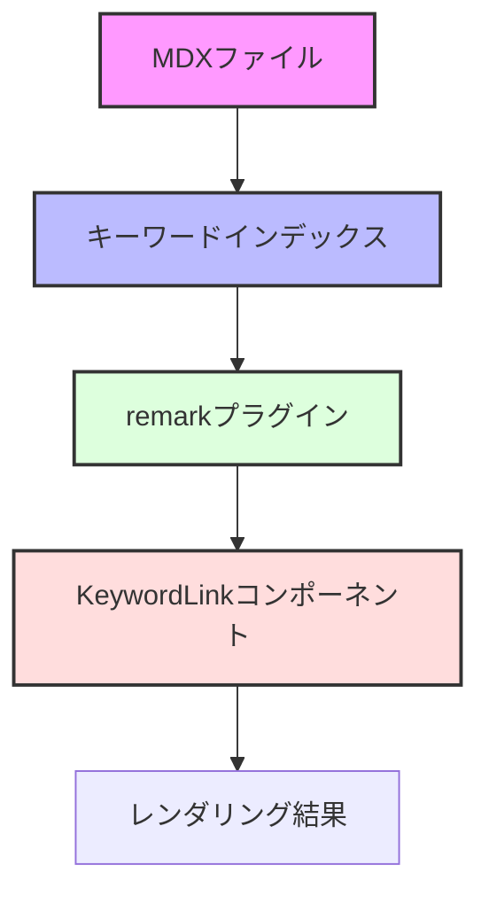

# MDXキーワードリンク機能の実装手順

## 概要

MDXファイル間でキーワードリンクを実現する機能の実装手順について説明します。この機能により、MDXファイル内で`[[キーワード]]`形式のリンクを使用して他のMDXファイルを参照できるようになります。

## 機能要件

### キーワードリンクの仕様

- 基本記法: `[[キーワード]]`
- 拡張記法: 
  - `[[キーワード|docs]]` (ドキュメントタイプを指定)
- リンクの状態表示:
  - 有効なリンク: 青色
  - 無効なリンク: 赤色
- タイトルの重複: ビルド時にエラーとして扱う

## 前提条件と環境設定

### 必要な知識
- TypeScript/React の基本的な理解
- MDX の基本概念
- remark/unified エコシステムの基礎知識

### 開発環境要件
- Node.js 20.0.0以上
- bun 1.0.0以上
- VSCode（推奨）

### プロジェクトの依存関係
```json
{
  "dependencies": {
    "unified": "^11.0.4",
    "@flex-development/unist-util-visit": "^1.1.0",
    "mdast-util-to-string": "^4.0.0",
    "@mdx-js/react": "^3.0.0",
    "clsx": "^2.0.0"
  }
}
```

## システム概要

### アーキテクチャ



### データフロー

1. MDXファイルの解析
2. キーワードインデックスの構築
3. リンクの変換とバリデーション
4. コンポーネントのレンダリング

## 実装手順

### Phase 1: キーワードインデックスの実装

#### 1.1 ディレクトリ構造の作成

```bash
mkdir -p apps/docs/lib/mdx
touch apps/docs/lib/mdx/{types,cache,keyword-index}.ts
```

#### 1.2 型定義の実装

```typescript
// apps/docs/lib/mdx/types.ts
export interface KeywordIdentifier {
  title: string;      // ドキュメントのタイトル
  docType: string;    // ドキュメントの種類（例: 'docs', 'api'）
  path: string;       // ドキュメントへの相対パス
}

export interface KeywordIndex {
  [keyword: string]: {
    documents: KeywordIdentifier[];  // キーワードに関連するドキュメント
    isAmbiguous: boolean;           // 重複があるかどうか
  };
}

export interface DuplicateTitleError {
  title: string;
  occurrences: KeywordIdentifier[];
}

export interface KeywordLinkProps {
  keyword: string;
  docType?: string;
  isValid: boolean;
}

// apps/docs/lib/mdx/cache.ts
export interface CacheConfig {
  enableFileWatcher: boolean;  // ファイル変更の監視
  updateInterval: number;      // 更新間隔（ミリ秒）
  ttl: number;                // キャッシュの有効期限
}

// 開発環境の設定
export const devConfig: CacheConfig = {
  enableFileWatcher: true,    // ファイル変更を監視
  updateInterval: 5 * 60_000, // 5分ごとに更新
  ttl: 10 * 60_000           // 10分でキャッシュ無効化
};

// 本番環境の設定
export const prodConfig: CacheConfig = {
  enableFileWatcher: false,   // 監視無効
  updateInterval: 0,          // 更新なし
  ttl: Infinity              // キャッシュ永続化
};
```

#### 1.3 インデックス構築関数の実装

```typescript
// apps/docs/lib/mdx/keyword-index.ts
import { DocNode } from '../docs';
import { CacheConfig } from './cache';

export function buildKeywordIndex(
  docTree: DocNode[],
  config: CacheConfig
): {
  index: KeywordIndex;
  duplicates: DuplicateTitleError[];
} {
  const index: KeywordIndex = {};
  const duplicates: DuplicateTitleError[] = [];
  
  function traverseTree(nodes: DocNode[], docType: string) {
    for (const node of nodes) {
      if (node.title) {
        const entry = index[node.title] || { documents: [], isAmbiguous: false };
        
        if (entry.documents.length > 0) {
          entry.isAmbiguous = true;
          duplicates.push({
            title: node.title,
            occurrences: [...entry.documents, { title: node.title, docType, path: node.slug }]
          });
        }
        
        entry.documents.push({
          title: node.title,
          docType,
          path: node.slug
        });
        
        index[node.title] = entry;
      }
      
      traverseTree(node.children, docType);
    }
  }
  
  traverseTree(docTree, 'docs');
  
  return { index, duplicates };
}

// インデックスの使用例
const docTree = getDocTree();
const { index, duplicates } = buildKeywordIndex(
  docTree,
  process.env.NODE_ENV === 'development' ? devConfig : prodConfig
);

// 重複チェックの例
if (duplicates.length > 0) {
  console.warn('重複したタイトルが見つかりました:', duplicates);
}
```

### Phase 2: MDXパーサーの拡張

#### 2.1 remarkプラグインの実装

```typescript
// apps/docs/lib/mdx/remark-keyword-links.ts
import { visit } from '@flex-development/unist-util-visit';
import type { Plugin } from 'unified';
import type { KeywordIndex } from './types';

export function remarkKeywordLinks(keywordIndex: KeywordIndex): Plugin {
  return (tree) => {
    visit(tree, 'text', (node, index, parent) => {
      const matches = node.value.match(/\[\[(.*?)(?:\|(.*?))?\]\]/g);
      if (!matches) return;

      const parts = matches.map(match => {
        const [, keyword, docType] = match.match(/\[\[(.*?)(?:\|(.*?))?\]\]/) || [];
        return { keyword, docType };
      });

      // テキストノードを分割して、リンクノードに変換
      const nodes = [];
      let lastIndex = 0;

      parts.forEach(({ keyword, docType }) => {
        const entry = keywordIndex[keyword];
        const isValid = entry && (!entry.isAmbiguous || docType);
        
        nodes.push({
          type: 'mdxJsxTextElement',
          name: 'KeywordLink',
          attributes: [
            { type: 'mdxJsxAttribute', name: 'keyword', value: keyword },
            { type: 'mdxJsxAttribute', name: 'isValid', value: isValid },
            docType && { type: 'mdxJsxAttribute', name: 'docType', value: docType }
          ].filter(Boolean),
          children: [{ type: 'text', value: keyword }]
        });
      });

      parent.children.splice(index, 1, ...nodes);
    });
  };
}
```

#### 2.2 MDXバンドラーの設定

```typescript
// apps/docs/lib/docs.ts
export const getDocFromParams = cache(async (slug: string[]) => {
  try {
    // ... 既存のコード ...

    const { code, frontmatter } = await bundleMDX({
      source,
      esbuildOptions: (options) => {
        options.target = ['es2020'];
        return options;
      },
      mdxOptions(options) {
        // キーワードインデックスを構築
        const docTree = getDocTree();
        const { index, duplicates } = buildKeywordIndex(docTree, 
          process.env.NODE_ENV === 'development' ? devConfig : prodConfig
        );

        // 重複エラーのチェック
        if (duplicates.length > 0) {
          const errorMessage = duplicates
            .map(d => `タイトル "${d.title}" が複数のファイルで使用されています: ${d.occurrences.map(o => o.path).join(', ')}`)
            .join('\n');
          throw new Error(`重複したタイトルが見つかりました:\n${errorMessage}`);
        }

        options.remarkPlugins = [
          ...(options.remarkPlugins ?? []),
          [remarkKeywordLinks, index],
          remarkGfm
        ];
        return options;
      },
    });

    // ... 残りのコード ...
  } catch (error) {
    console.error('MDXの処理中にエラーが発生しました:', error);
    throw error;
  }
});
```

### Phase 3: コンポーネントの実装

#### 3.1 KeywordLinkコンポーネント

```typescript
// apps/docs/components/mdx/KeywordLink.tsx
import { KeywordLinkProps } from '../../lib/mdx/types';
import clsx from 'clsx';

export const KeywordLink: React.FC<KeywordLinkProps> = ({
  keyword,
  docType,
  isValid
}) => {
  return (
    <span
      className={clsx(
        'keyword-link',
        'inline-block',
        'transition-colors',
        isValid ? 'text-blue-500 hover:text-blue-600' : 'text-red-500 hover:text-red-600',
        'cursor-pointer'
      )}
      title={`${keyword}${docType ? ` (${docType})` : ''}`}
    >
      {keyword}
    </span>
  );
};
```

## テスト計画

### 1. 単体テスト

#### 1.1 キーワードインデックス
```typescript
// __tests__/keyword-index.test.ts
describe('buildKeywordIndex', () => {
  it('正しくインデックスを構築できること', () => {
    const docTree = [
      { title: 'テスト1', slug: '/test1' },
      { title: 'テスト2', slug: '/test2' }
    ];
    const { index, duplicates } = buildKeywordIndex(docTree, devConfig);
    
    expect(index['テスト1']).toBeDefined();
    expect(duplicates).toHaveLength(0);
  });
});
```

#### 1.2 remarkプラグイン
```typescript
// __tests__/remark-keyword-links.test.ts
describe('remarkKeywordLinks', () => {
  it('キーワードリンクを正しく変換できること', () => {
    const input = '[[テスト1]]';
    const expected = '<KeywordLink keyword="テスト1" isValid={true} />';
    // ... テストの実装 ...
  });
});
```

### 2. 統合テスト

#### 2.1 エンドツーエンドテスト
```typescript
// __tests__/e2e/keyword-links.test.ts
describe('KeywordLinks E2E', () => {
  it('MDXファイルでキーワードリンクが機能すること', async () => {
    // ... テストの実装 ...
  });
});
```

## トラブルシューティング

### よくある問題と解決方法

1. **キーワードインデックスが更新されない**
   - キャッシュの TTL を確認
   - `enableFileWatcher` の設定を確認
   - キャッシュファイルの手動削除を試す

2. **リンクが正しく変換されない**
   - remarkプラグインの順序を確認
   - MDXの構文エラーをチェック
   - コンソールのエラーメッセージを確認

3. **パフォーマンスの問題**
   - キャッシュの設定を最適化
   - 不要なインデックス更新を防ぐ
   - 大きなMDXファイルの分割を検討

## パフォーマンス最適化

### 1. キャッシュ戦略
- インメモリキャッシュの活用
- 差分更新の実装
- バッチ処理の導入

### 2. インデックス最適化
- インデックスの圧縮
- 遅延ロードの実装
- 不要なデータの削除

## デプロイ手順

1. **ビルド**
```bash
cd apps/docs
bun run build
```

2. **動作確認**
- キーワードリンクの表示確認
- エラー表示の確認
- パフォーマンスの確認

## 注意事項

1. **エラーハンドリング**
- エラーメッセージは全て日本語で表示
- スタックトレースの保存
- エラーログの集計

2. **メンテナンス**
- 定期的なキャッシュクリーンアップ
- パフォーマンスモニタリング
- 依存パッケージの更新確認 