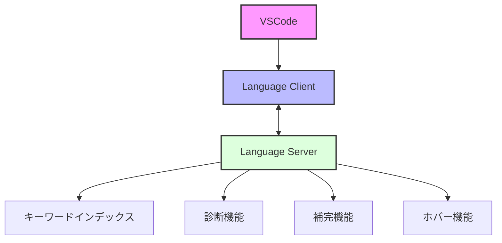
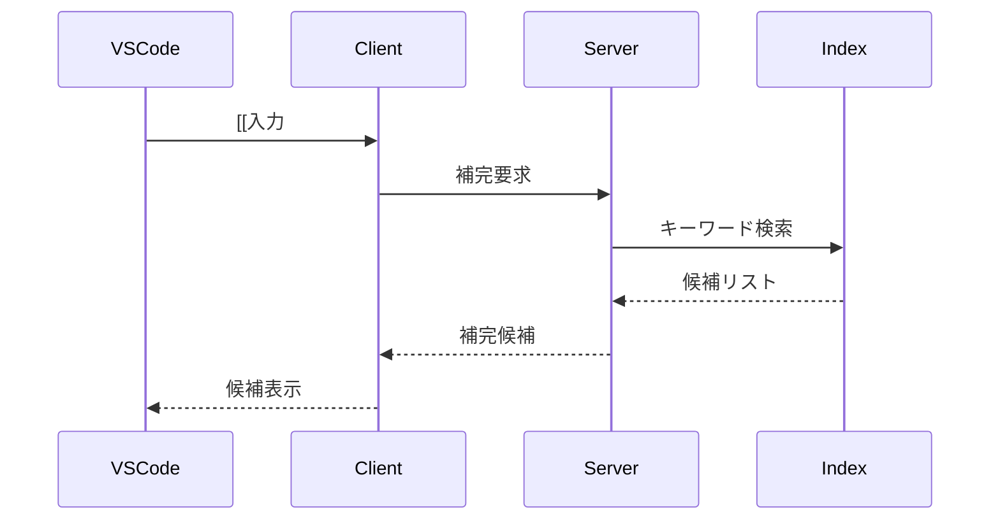
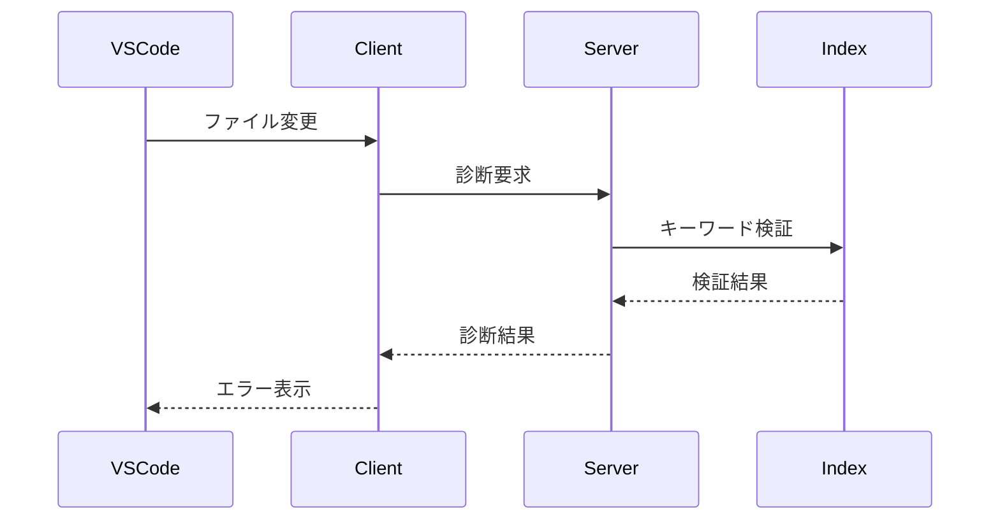

# MDXキーワードリンク VSCode拡張機能の実装手順

## 概要

MDXファイル内のキーワードリンク（`[[キーワード]]`形式）をサポートするVSCode拡張機能の実装手順について説明します。この拡張機能により、エディタ上でのキーワード入力補完、リンクの有効性チェック、ホバープレビューなどの機能が提供されます。

## 機能要件

1. **キーワード入力補完**
   - `[[` 入力時に補完候補を表示
   - 候補には title と description を表示
   - ドキュメントタイプごとにグループ化

2. **リンクの有効性チェック**
   - 有効なリンク: 青色の下線
   - 無効なリンク: 赤色の波線
   - 重複タイトルの警告: 黄色の波線

3. **ホバープレビュー**
   - タイトル
   - 説明文
   - パス情報
   - ドキュメントタイプ

## 前提条件と環境設定

### 必要な知識
- VSCode拡張機能開発の基礎
- TypeScript/Node.jsの基本的な理解
- Language Server Protocol (LSP)の基本概念

### 開発環境要件
- Node.js 20.0.0以上
- VSCode 1.85.0以上
- yo (Yeoman) と generator-code
```bash
npm install -g yo generator-code
```

### プロジェクト構成
```
packages/vscode-mdx-links/
├── package.json
├── tsconfig.json
├── src/
│   ├── extension.ts      # 拡張機能のエントリーポイント
│   ├── server/          # 言語サーバー
│   │   ├── server.ts    # サーバーのエントリーポイント
│   │   ├── keyword-index.ts
│   │   ├── diagnostics.ts
│   │   └── hover.ts
│   └── client/          # クライアント
│       └── extension.ts
└── __tests__/          # テストファイル
```

## システム概要

### アーキテクチャ



### 機能フロー

1. **補完機能**


2. **診断機能**


## 実装手順

### Phase 1: プロジェクトセットアップ

#### 1.1 プロジェクト作成
```bash
# プロジェクトディレクトリの作成
mkdir -p packages/vscode-mdx-links
cd packages/vscode-mdx-links

# Yeomanを使用して拡張機能のスケルトンを生成
yo code

# プロンプトでの選択項目
? What type of extension do you want to create? Language Server
? What's the name of your extension? mdx-keyword-links
? What's the identifier of your extension? mdx-keyword-links
? What's the description of your extension? MDXキーワードリンクのサポート
? Initialize a git repository? No
? Which package manager to use? bun
```

#### 1.2 依存関係の設定
```json
{
  "name": "vscode-mdx-links",
  "version": "0.1.0",
  "engines": {
    "vscode": "^1.85.0"
  },
  "dependencies": {
    "vscode-languageserver": "^8.1.0",
    "vscode-languageserver-textdocument": "^1.0.8"
  },
  "devDependencies": {
    "@types/vscode": "^1.85.0",
    "@vscode/test-electron": "^2.3.8",
    "@types/node": "^18.0.0",
    "typescript": "^5.0.0"
  },
  "activationEvents": [
    "onLanguage:mdx"
  ],
  "contributes": {
    "languages": [{
      "id": "mdx",
      "extensions": [".mdx"]
    }]
  }
}
```

### Phase 2: 言語サーバーの実装

#### 2.1 キーワードインデックスマネージャー
```typescript
// src/server/keyword-index.ts
import { KeywordIndex } from '../../apps/docs/lib/mdx/types';
import * as path from 'path';
import * as fs from 'fs/promises';

export class KeywordIndexManager {
  private index: KeywordIndex | null = null;
  private lastUpdate: number = 0;
  private readonly updateInterval: number = 5 * 60 * 1000; // 5分

  async loadIndex(workspacePath: string): Promise<void> {
    const now = Date.now();
    if (this.index && now - this.lastUpdate < this.updateInterval) {
      return; // キャッシュが有効な場合は早期リターン
    }

    try {
      const cachePath = path.join(workspacePath, '.cache/keyword-index.json');
      const data = await fs.readFile(cachePath, 'utf-8');
      this.index = JSON.parse(data);
      this.lastUpdate = now;
    } catch (error) {
      console.error('インデックスの読み込みに失敗しました:', error);
      throw new Error('キーワードインデックスの読み込みに失敗しました。');
    }
  }

  getCompletionItems(keyword: string): CompletionItem[] {
    if (!this.index) return [];
    
    return Object.entries(this.index)
      .filter(([title]) => title.toLowerCase().includes(keyword.toLowerCase()))
      .map(([title, info]) => ({
        label: title,
        detail: info.documents[0].docType,
        documentation: {
          kind: MarkupKind.Markdown,
          value: [
            `# ${title}`,
            '',
            info.documents[0].description || '',
            '',
            `**タイプ**: ${info.documents[0].docType}`,
            `**パス**: \`${info.documents[0].path}\``
          ].join('\n')
        },
        kind: CompletionItemKind.Reference
      }));
  }

  // デバッグ用メソッド
  getDiagnostics(): string {
    return `インデックスサイズ: ${Object.keys(this.index || {}).length}
最終更新: ${new Date(this.lastUpdate).toLocaleString()}`;
  }
}
```

#### 2.2 診断機能
```typescript
// src/server/diagnostics.ts
import {
  Diagnostic,
  DiagnosticSeverity,
  Range
} from 'vscode-languageserver/node';
import { TextDocument } from 'vscode-languageserver-textdocument';
import { KeywordIndex } from '../../apps/docs/lib/mdx/types';

export function validateDocument(
  document: TextDocument,
  index: KeywordIndex
): Diagnostic[] {
  const diagnostics: Diagnostic[] = [];
  const text = document.getText();
  const linkPattern = /\[\[(.*?)(?:\|(.*?))?\]\]/g;
  let match;

  while ((match = linkPattern.exec(text))) {
    const [fullMatch, keyword, docType] = match;
    const range: Range = {
      start: document.positionAt(match.index),
      end: document.positionAt(match.index + fullMatch.length)
    };

    const entry = index[keyword];
    if (!entry) {
      diagnostics.push(createDiagnostic(
        range,
        `キーワード "${keyword}" は存在しません。`,
        DiagnosticSeverity.Error
      ));
    } else if (entry.isAmbiguous && !docType) {
      const paths = entry.documents.map(d => d.path).join(', ');
      diagnostics.push(createDiagnostic(
        range,
        `キーワード "${keyword}" は複数のドキュメントで使用されています: ${paths}`,
        DiagnosticSeverity.Warning
      ));
    }
  }

  return diagnostics;
}

function createDiagnostic(
  range: Range,
  message: string,
  severity: DiagnosticSeverity
): Diagnostic {
  return {
    severity,
    range,
    message,
    source: 'mdx-links'
  };
}
```

#### 2.3 ホバー機能
```typescript
// src/server/hover.ts
import {
  Hover,
  MarkupContent,
  Position
} from 'vscode-languageserver/node';
import { TextDocument } from 'vscode-languageserver-textdocument';
import { KeywordIndex } from '../../apps/docs/lib/mdx/types';

export function provideHover(
  document: TextDocument,
  position: Position,
  index: KeywordIndex
): Hover | null {
  const range = getKeywordRange(document, position);
  if (!range) return null;

  const text = document.getText(range);
  const [, keyword] = text.match(/\[\[(.*?)(?:\|(.*?))?\]\]/) || [];
  if (!keyword) return null;

  const entry = index[keyword];
  if (!entry) return null;

  const doc = entry.documents[0];
  const content: MarkupContent = {
    kind: 'markdown',
    value: [
      `# ${doc.title}`,
      '',
      doc.description || '',
      '',
      '---',
      '',
      `**ドキュメントタイプ**: ${doc.docType}`,
      `**パス**: \`${doc.path}\``,
      entry.isAmbiguous ? '\n**注意**: このキーワードは複数のドキュメントで使用されています。' : ''
    ].join('\n')
  };

  return { contents: content };
}

function getKeywordRange(document: TextDocument, position: Position) {
  const text = document.getText();
  const pattern = /\[\[(.*?)(?:\|(.*?))?\]\]/g;
  let match;

  while ((match = pattern.exec(text))) {
    const start = document.positionAt(match.index);
    const end = document.positionAt(match.index + match[0].length);
    
    if (isPositionInRange(position, { start, end })) {
      return { start, end };
    }
  }

  return null;
}

function isPositionInRange(position: Position, range: { start: Position; end: Position }) {
  return (
    (position.line > range.start.line ||
      (position.line === range.start.line && position.character >= range.start.character)) &&
    (position.line < range.end.line ||
      (position.line === range.end.line && position.character <= range.end.character))
  );
}
```

### Phase 3: クライアント側の実装

#### 3.1 拡張機能のアクティベーション
```typescript
// src/extension.ts
import * as path from 'path';
import { ExtensionContext } from 'vscode';
import {
  LanguageClient,
  LanguageClientOptions,
  ServerOptions,
  TransportKind
} from 'vscode-languageclient/node';

let client: LanguageClient;

export function activate(context: ExtensionContext) {
  const serverModule = context.asAbsolutePath(path.join('dist', 'server.js'));
  
  const serverOptions: ServerOptions = {
    run: {
      module: serverModule,
      transport: TransportKind.ipc,
      options: { cwd: process.cwd() }
    },
    debug: {
      module: serverModule,
      transport: TransportKind.ipc,
      options: {
        execArgv: ['--nolazy', '--inspect=6009'],
        cwd: process.cwd()
      }
    }
  };

  const clientOptions: LanguageClientOptions = {
    documentSelector: [{ scheme: 'file', language: 'mdx' }],
    synchronize: {
      fileEvents: workspace.createFileSystemWatcher('**/*.mdx')
    },
    middleware: {
      // カスタムミドルウェアの設定
      provideCompletionItem: async (document, position, context, token, next) => {
        // キーワード入力時のみ補完を提供
        const range = document.getWordRangeAtPosition(position, /\[\[(.*?)(?:\|(.*?))?\]\]/);
        if (!range) return null;
        return next(document, position, context, token);
      }
    }
  };

  client = new LanguageClient(
    'mdxKeywordLinks',
    'MDX Keyword Links',
    serverOptions,
    clientOptions
  );

  context.subscriptions.push(
    client.start(),
    // ステータスバーの更新
    window.onDidChangeActiveTextEditor(updateStatusBar)
  );
}

export function deactivate(): Thenable<void> | undefined {
  return client?.stop();
}

// ステータスバーの更新
function updateStatusBar() {
  const editor = window.activeTextEditor;
  if (!editor || editor.document.languageId !== 'mdx') {
    return;
  }

  const diagnostics = languages.getDiagnostics(editor.document.uri);
  const errorCount = diagnostics.filter(d => d.severity === DiagnosticSeverity.Error).length;
  const warningCount = diagnostics.filter(d => d.severity === DiagnosticSeverity.Warning).length;

  if (errorCount > 0 || warningCount > 0) {
    window.setStatusBarMessage(
      `MDXリンク: ${errorCount} エラー, ${warningCount} 警告`
    );
  }
}
```

## テスト計画

### 1. 単体テスト

#### 1.1 キーワードインデックス
```typescript
// __tests__/keyword-index.test.ts
import { KeywordIndexManager } from '../src/server/keyword-index';

describe('KeywordIndexManager', () => {
  let manager: KeywordIndexManager;

  beforeEach(() => {
    manager = new KeywordIndexManager();
  });

  test('インデックスの読み込みと検索', async () => {
    await manager.loadIndex('/path/to/workspace');
    const items = manager.getCompletionItems('test');
    expect(items).toBeDefined();
    expect(Array.isArray(items)).toBe(true);
  });
});
```

#### 1.2 診断機能
```typescript
// __tests__/diagnostics.test.ts
import { validateDocument } from '../src/server/diagnostics';
import { TextDocument } from 'vscode-languageserver-textdocument';

describe('Diagnostics', () => {
  test('無効なキーワードを検出', () => {
    const document = TextDocument.create(
      'test.mdx',
      'mdx',
      1,
      '[[存在しないキーワード]]'
    );
    const diagnostics = validateDocument(document, {});
    expect(diagnostics).toHaveLength(1);
    expect(diagnostics[0].severity).toBe(DiagnosticSeverity.Error);
  });
});
```

### 2. 統合テスト

#### 2.1 エンドツーエンドテスト
```typescript
// __tests__/e2e/extension.test.ts
import * as vscode from 'vscode';
import * as assert from 'assert';
import * as path from 'path';

suite('Extension E2E Test Suite', () => {
  test('補完機能', async () => {
    const doc = await vscode.workspace.openTextDocument({
      content: '[[',
      language: 'mdx'
    });
    const editor = await vscode.window.showTextDocument(doc);
    const position = new vscode.Position(0, 2);
    
    const completions = await vscode.commands.executeCommand<vscode.CompletionList>(
      'vscode.executeCompletionItemProvider',
      doc.uri,
      position
    );
    
    assert.ok(completions?.items.length > 0);
  });
});
```

## デバッグ方法

### 1. 拡張機能のデバッグ
1. VSCodeで`F5`キーを押してデバッグセッションを開始
2. 新しいVSCodeウィンドウが開き、拡張機能がロードされる
3. デバッグコンソールでログを確認

### 2. 言語サーバーのデバッグ
1. `launch.json`に以下の設定を追加:
```json
{
  "configurations": [
    {
      "type": "node",
      "request": "attach",
      "name": "Attach to Server",
      "port": 6009,
      "restart": true
    }
  ]
}
```

### 3. ログの確認
- 出力パネルで「MDX Keyword Links」を選択
- デバッグコンソールでサーバーのログを確認

## トラブルシューティング

### よくある問題と解決方法

1. **補完が動作しない**
   - 言語サーバーが正しく起動しているか確認
   - `activationEvents`の設定を確認
   - ログで詳細を確認

2. **診断が表示されない**
   - インデックスが正しく読み込まれているか確認
   - ファイル変更イベントが発火しているか確認
   - 診断の重要度設定を確認

3. **パフォーマンスの問題**
   - インデックスのキャッシュ状態を確認
   - メモリ使用量をモニタリング
   - 不要な更新を最小限に

## デプロイ手順

### 1. パッケージング
```bash
cd packages/vscode-mdx-links
bun install
bun run compile
bun run package
```

### 2. テスト
```bash
bun run test
```

### 3. 公開
```bash
vsce publish
```

## 注意事項

### 1. パフォーマンス
- 大きなワークスペースでのインデックス更新を最適化
- メモリリークを防ぐためのクリーンアップ
- 不要な診断更新の防止

### 2. エラーハンドリング
- ユーザーフレンドリーなエラーメッセージ
- 適切なエラーログ
- リカバリー処理の実装

### 3. メンテナンス
- 定期的な依存関係の更新
- バグ報告への対応体制
- ドキュメントの更新 