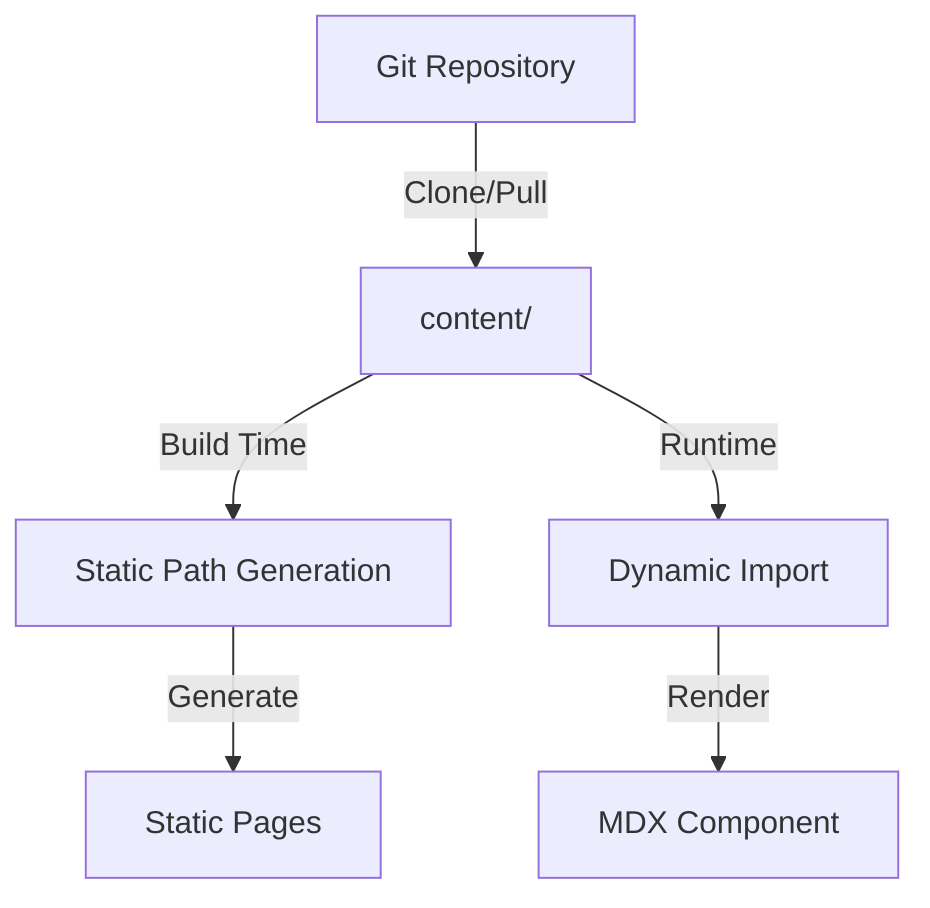
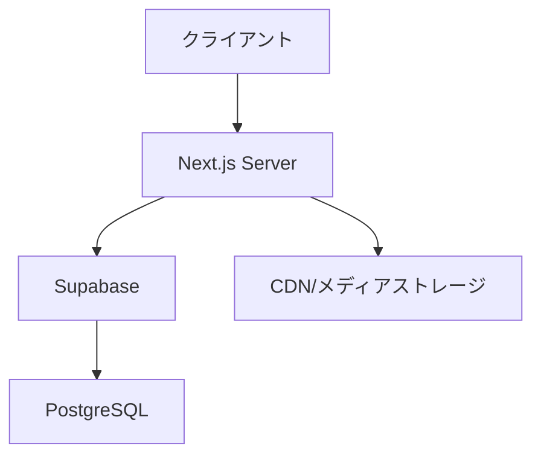

# 技術要件定義

## 1. 技術スタック

### 1.1 フロントエンド
| 技術 | バージョン | 選定理由 | 制約事項 |
|---|---|----|-----|
| Next.js | 15.x | - App RouterによるMDXの効率的な処理- サーバーコンポーネントによるパフォーマンス最適化 - TypeScriptの完全サポート | - Node.js 18.17以上が必要 |
| TypeScript | 5.x | - 型安全性の確保- 開発効率の向上- コードの保守性向上 | - 学習コスト |
| Tailwind CSS | 4.x | - 高い開発効率- カスタマイズ性- 軽量な出力 | - クラス名の管理 |
| MDX | 3.x | - Markdownの拡張機能- JSXとの統合- プラグイン対応 | - ビルド時の最適化が必要 |

### 1.2 バックエンド
| 技術 | バージョン | 選定理由 | 制約事項 |
|---|---|----|-----|
| Supabase | 最新 | - 認証機能の組み込み- リアルタイムデータ同期- メディアストレージ | - 無料プランの制限 |
| PostgreSQL | 15.x | - 高度なクエリ機能- JSONBサポート- 全文検索対応 | - 初期設定の複雑さ |

### 1.3 コンテンツ管理
| 技術 | 用途 | 利点 |
|---|---|----|
| GitHub | MDXコンテンツ管理 | - バージョン管理- 共同編集- PRベースのレビュー |
| GitHub Actions | CI/CD | - 自動ビルド- コンテンツ検証- 自動デプロイ |

### 1.4 ファイル構造
```
src/
├── app/                    # Next.js App Router
│   ├── (auth)/            # 認証関連ページ
│   ├── docs/[...slug]/    # ドキュメントページのルートハンドラー
│   │   ├── page.tsx       # MDXレンダリングページ
│   │   └── layout.tsx     # ドキュメント用レイアウト
│   └── api/               # APIルート
├── components/            # 共通コンポーネント
└── content/              # MDXコンテンツ（Git管理）
    ├── docs/             # ドキュメントコンテンツ
    │   ├── getting-started/
    │   │   ├── introduction.mdx
    │   │   └── setup.mdx
    │   └── guides/
    │       ├── basic/
    │       │   └── first-steps.mdx
    │       └── advanced/
    │           └── optimization.mdx
    └── _meta.json        # サイト構造とメタデータ
```

### 1.5 ルーティング設計

#### MDXファイルとURLのマッピング
```typescript
interface RouteMapping {
  // ファイルパス → URL
  'docs/getting-started/introduction.mdx' => '/docs/getting-started/introduction'
  'docs/guides/basic/first-steps.mdx' => '/docs/guides/basic/first-steps'
}

interface MetaData {
  title: string;
  description?: string;
  sidebar: {
    order: number;
    label: string;
  };
  // その他のメタデータ
}
```

#### ルートハンドラーの実装
```typescript
// app/docs/[...slug]/page.tsx
interface PageProps {
  params: {
    slug: string[];
  };
}

async function getDocFromParams(slug: string[]) {
  const docPath = path.join(process.cwd(), 'content', 'docs', ...slug) + '.mdx';
  
  if (!fs.existsSync(docPath)) {
    notFound();
  }

  const fileContent = await fs.readFile(docPath, 'utf8');
  const { frontmatter, content } = await parseMDX(fileContent);
  
  return {
    frontmatter,
    content,
    slug: slug.join('/')
  };
}

export default async function DocPage({ params }: PageProps) {
  const doc = await getDocFromParams(params.slug);
  return <MDXComponent {...doc} />;
}

// 静的パスの生成
export async function generateStaticParams() {
  const docs = await getAllDocPaths();
  return docs.map(doc => ({
    slug: doc.split('/')
  }));
}
```

### 1.6 コンテンツ同期フロー



## 2. アーキテクチャ設計

### 2.1 システム構成



### 2.2 データモデル詳細設計

#### ユーザー管理
```typescript
interface User {
  id: string;
  email: string;
  name: string;
  role: 'admin' | 'author' | 'reader';
  createdAt: Date;
  lastLogin: Date;
}
```

#### コンテンツ管理
```typescript
interface Content {
  id: string;
  slug: string;
  title: string;
  description: string;
  content: string; // MDX content
  author: User;
  status: 'draft' | 'published';
  version: number;
  mediaAssets: MediaAsset[];
  tags: string[];
  createdAt: Date;
  updatedAt: Date;
  publishedAt?: Date;
}

interface MediaAsset {
  id: string;
  contentId: string;
  type: 'image' | 'video' | 'code';
  url: string;
  caption?: string;
  metadata: {
    size: number;
    dimensions?: {
      width: number;
      height: number;
    };
    mimeType: string;
  };
}
```

#### 学習進捗管理
```typescript
interface UserProgress {
  userId: string;
  contentId: string;
  lastRead: Date;
  readCount: number;
  completionStatus: 'not_started' | 'in_progress' | 'completed';
}
```

### 2.3 API設計

#### RESTful APIエンドポイント
```typescript
interface APIEndpoints {
  // コンテンツ管理
  'GET /api/contents': () => Content[];
  'GET /api/contents/:id': (id: string) => Content;
  'POST /api/contents': (content: CreateContentDTO) => Content;
  'PUT /api/contents/:id': (id: string, content: UpdateContentDTO) => Content;
  
  // メディア管理
  'POST /api/media': (file: File) => MediaAsset;
  'DELETE /api/media/:id': (id: string) => void;
  
  // 進捗管理
  'GET /api/progress': () => UserProgress[];
  'POST /api/progress': (progress: CreateProgressDTO) => UserProgress;
}
```

### 2.4 コンテンツ更新フロー
1. ローカル開発
   - `main` ブランチからの feature ブランチ作成
   - MDXファイルの編集
   - ローカルでのプレビュー確認

2. レビュープロセス
   - PRの作成
   - 自動コンテンツ検証
   - レビュアーによる確認

3. デプロイメント
   - `main` ブランチへのマージ
   - 自動ビルド・デプロイ
   - コンテンツの公開

## 3. セキュリティ設計

### 3.1 認証・認可
- Supabaseの認証システムを利用
- JWTベースのセッション管理
- ロールベースのアクセス制御（RBAC）

### 3.2 データ保護
- HTTPS通信の強制
- メディアアセットの署名付きURL
- バックアップの自動化

## 4. パフォーマンス最適化

### 4.1 フロントエンド
- 画像の最適化
  - WebPフォーマットの使用
  - 適切なサイズへのリサイズ
  - 遅延読み込み
- MDXのキャッシュ
  - ビルド時の最適化
  - インクリメンタルビルド

### 4.2 バックエンド
- データベースインデックス
- キャッシュ戦略
- クエリの最適化

## 5. 監視・運用

### 5.1 モニタリング
- パフォーマンスメトリクス
  - ページロード時間
  - APIレスポンス時間
  - エラーレート
- ユーザー行動分析
  - アクセスパターン
  - コンテンツ閲覧統計

### 5.2 ログ管理
- アプリケーションログ
- アクセスログ
- エラーログ

## 6. デプロイメント

### 6.1 開発環境
- ローカル開発環境
  - Docker Compose
  - 開発用データベース
- テスト環境
  - 自動テスト
  - E2Eテスト

### 6.2 本番環境
- Vercelでのホスティング
- Supabase Cloud
- CDNの利用

## 7. バックアップ・リカバリ

### 7.1 バックアップ戦略
- データベース
  - 日次完全バックアップ
  - 差分バックアップ
- メディアアセット
  - クラウドストレージの冗長化
  - 定期的なバックアップ

### 7.2 リカバリ手順
- 障害検知
- バックアップからの復旧
- 動作確認 

## 8. 管理機能の技術要件

### 8.1 GitHub連携

#### API統合
```typescript
interface GitHubService {
  // コンテンツ操作
  createCommit(files: FileChange[]): Promise<CommitResult>;
  createPullRequest(branch: string, title: string): Promise<PRResult>;
  
  // ブランチ管理
  createBranch(name: string): Promise<void>;
  mergeBranch(pr: number): Promise<void>;
  
  // レビュー管理
  requestReview(pr: number, reviewers: string[]): Promise<void>;
  getReviewComments(pr: number): Promise<Comment[]>;
}

interface FileChange {
  path: string;
  content: string;
  message: string;
}
```

#### Webhook処理
```typescript
interface WebhookHandler {
  // イベント処理
  onPullRequestUpdate(event: PREvent): Promise<void>;
  onReviewSubmitted(event: ReviewEvent): Promise<void>;
  onCommitPush(event: PushEvent): Promise<void>;
}
```

### 8.2 メディア管理

#### ストレージ連携
```typescript
interface StorageService {
  // アップロード
  uploadMedia(file: File, metadata: MediaMetadata): Promise<MediaAsset>;
  deleteMedia(id: string): Promise<void>;
  
  // 最適化
  optimizeImage(file: File): Promise<File>;
  generateThumbnail(file: File): Promise<File>;
  
  // 使用状況
  getUsageStats(): Promise<StorageStats>;
  cleanUnusedMedia(): Promise<CleanupResult>;
}
```

#### メディアプロセッシング
```typescript
interface MediaProcessor {
  // 画像処理
  resize(file: File, dimensions: Dimensions): Promise<File>;
  convert(file: File, format: string): Promise<File>;
  
  // 動画処理
  compressVideo(file: File): Promise<File>;
  extractThumbnail(file: File): Promise<File>;
}
```

### 8.3 エディタ機能

#### MDXエディタ
```typescript
interface MDXEditor {
  // 編集機能
  insertComponent(component: string): void;
  insertMedia(asset: MediaAsset): void;
  
  // プレビュー
  renderPreview(): ReactNode;
  validateContent(): ValidationResult;
  
  // 履歴
  undo(): void;
  redo(): void;
}
```

#### プレビューエンジン
```typescript
interface PreviewEngine {
  // レンダリング
  renderMDX(content: string): Promise<ReactNode>;
  
  // デバイスプレビュー
  renderMobile(content: string): Promise<ReactNode>;
  renderTablet(content: string): Promise<ReactNode>;
  renderDesktop(content: string): Promise<ReactNode>;
}
```

### 8.4 ワークフロー管理

#### ステート管理
```typescript
interface WorkflowState {
  type: 'draft' | 'review' | 'approved' | 'published';
  assignee?: string;
  reviewers: string[];
  dueDate?: Date;
  comments: Comment[];
}

interface WorkflowService {
  // ステート遷移
  transition(contentId: string, newState: WorkflowState): Promise<void>;
  
  // 通知
  notifyReviewers(contentId: string): Promise<void>;
  notifyApproval(contentId: string): Promise<void>;
  
  // スケジュール
  schedulePublish(contentId: string, publishDate: Date): Promise<void>;
}
```

### 8.5 監視・分析

#### メトリクス収集
```typescript
interface MetricsCollector {
  // ストレージ
  trackStorageUsage(): Promise<StorageMetrics>;
  
  // パフォーマンス
  trackLoadTime(): Promise<PerformanceMetrics>;
  trackApiLatency(): Promise<ApiMetrics>;
  
  // エラー
  trackErrors(): Promise<ErrorMetrics>;
}
```

#### レポート生成
```typescript
interface ReportGenerator {
  // レポート
  generateUsageReport(): Promise<Report>;
  generateErrorReport(): Promise<Report>;
  generateAuditLog(): Promise<Report>;
  
  // エクスポート
  exportToCsv(report: Report): Promise<string>;
  exportToPdf(report: Report): Promise<Buffer>;
}
``` 