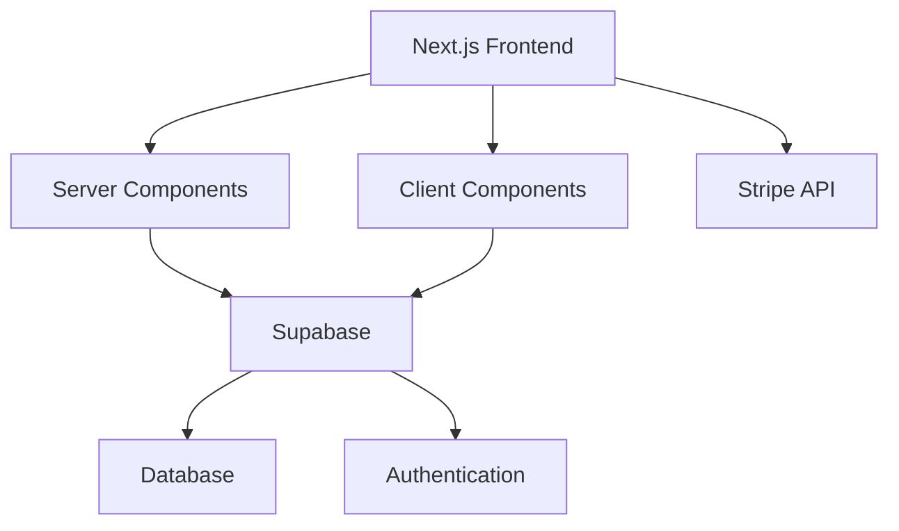

# MakerKit ドキュメント

[MakerKit](https://makerkit.dev/)は、[[Next.js]]、[[Supabase]]、[[TailwindCSS]]を使用したモダンなSaaSアプリケーションテンプレートです。
このドキュメントでは、MakerKitを使用してアプリケーションを構築・カスタマイズする方法を説明します。

## 主な機能

- 🚀 **最新のテクノロジースタック**: Next.js 15、React Server Components、TailwindCSS
- 🔐 **認証とセキュリティ**: Supabaseによる堅牢な認証システム
- 💳 **決済システム**: Stripeによる柔軟な課金システム
- 📧 **メール機能**: カスタマイズ可能なメールテンプレート
- 🌐 **多言語対応**: i18nによる国際化サポート
- 📊 **分析機能**: 組み込み済みの分析ツール

## はじめに

1. [インストールガイド](/makerkit/installation/introduction)で環境構築を行う
2. [設定ガイド](/makerkit/configuration/environment-variables)で必要な設定を行う
3. [開発ガイド](/makerkit/development)でアプリケーションの開発を始める

## コードブロックのテスト

以下はJavaScriptのコードブロックです：

```javascript
function hello() {
  console.log("Hello, world!");
}
hello();
```

## アーキテクチャ概要

MakerKitは以下のような構成になっています：



## サポートとコミュニティ

- [トラブルシューティング](/makerkit/troubleshooting)で一般的な問題の解決方法を確認
- [GitHub Issues](https://github.com/your-repo/issues)で問題を報告
- [Discord](https://discord.gg/your-community)でコミュニティに参加

## 更新履歴

- 最終更新日: 2024-03-10
- バージョン: 1.0.0
- メンテナー: Akimasa Sugai 